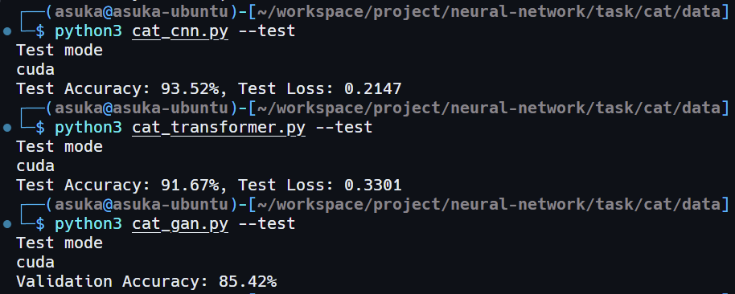
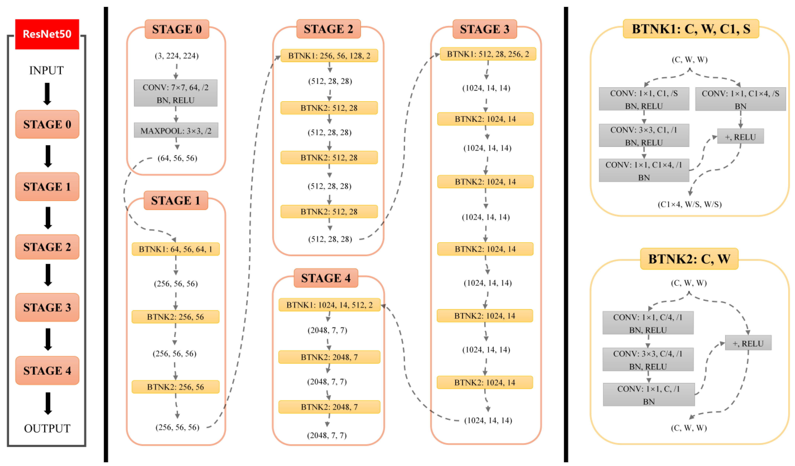
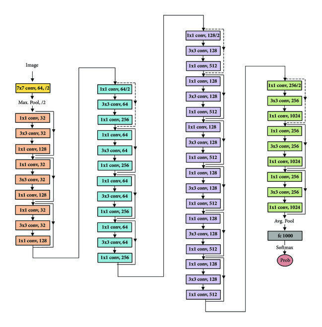
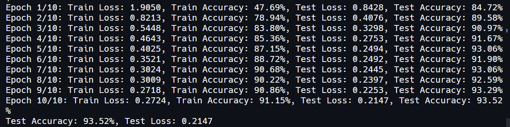
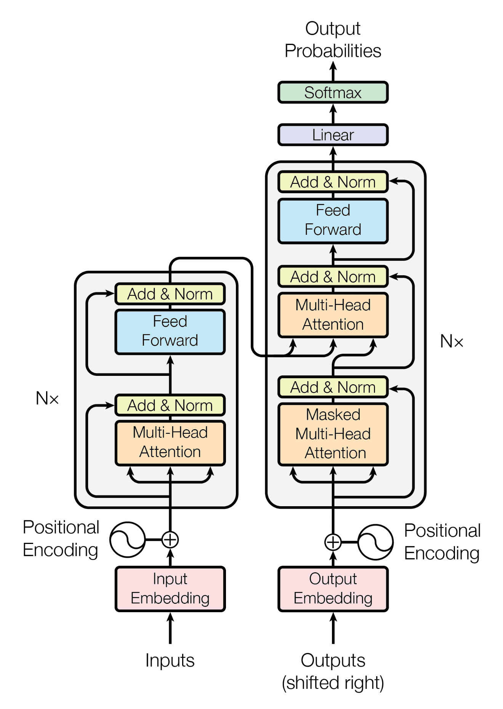
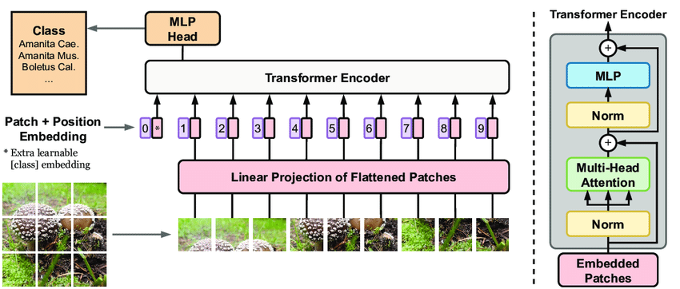
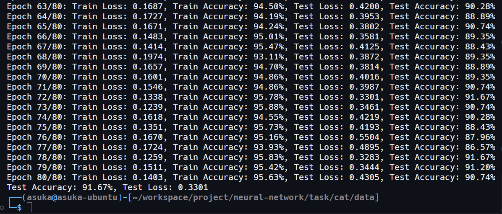
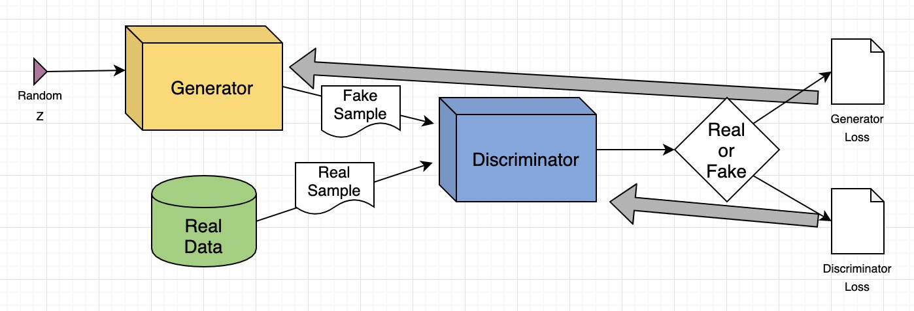
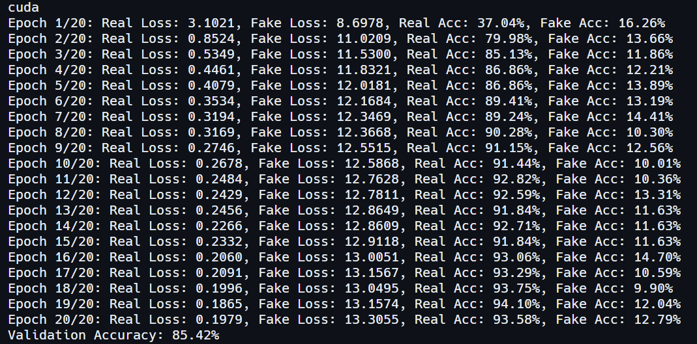

# 猫十二分类

## 实验目的和要求

**任务简介**：根据所学的人工神经网络的知识对十二种猫进行分类，属于 CV 方向经典的图像分类任务。图像分类是计算机视觉领域的一个基本任务，其目标是将输入的图像分配给某个预定义的类别（即标签）

**数据集介绍**：数据集包含 12 种猫的图片，并划分为训练集与测试集。训练集：提供图片以及图片所属的分类，共有 2160 张猫的图片，含标注文件。测试集：仅提供彩色图片，共有 240 张猫的图片，不含标注文件

**目的**：考察学生对于人工神经网络课程的学习情况

**任务要求**：

1. 分别使用 CNN 网络以及 Transformer 网络实现 2 种不同的基于深度学习的识别方式，可以使用预训练模型，测试集的识别率大于等于 0.9，不建议使用参数量和计算量比较大的模型，使用 pytorch 和 paddle 框架都可以
2. 撰写实验报告
3. 使用 GAN 网络进行实现（拓展内容）

## 使用方式

- 项目地址：https://github.com/ASUKA39/SYSU-ANNs-Term-Project.git

- 操作系统：Ubuntu 22.04 LTS

- Python 依赖库：

  - pytorch

  - torchvision

  - numpy

  - pandas

  - matplotlib
  - scikit-learn

- 目录结构：数据集、代码和模型权重均位于同一级目录

- 模型权重：

- 运行：

  ```shell
  python3 <script_name>.py --test		# 测试
  python3 <script_name>.py			# 训练并测试
  ```



## CNN

### 简介

卷积神经网络（CNN）是一种前馈神经网络，它的人工神经元可以响应一部分覆盖范围内的周围单元，卷积神经网络对于大型图像处理有出色表现

卷积神经网络由一个或多个卷积层和顶端的全连通层（对应经典的神经网络）组成，同时也包括关联权重和池化层。这一结构使得卷积神经网络能够利用输入数据的二维结构

卷积神经网络由输入层、隐藏层和输出层组成。卷积神经网络通常由三个主要部分组成：输入层、隐藏层和输出层。在输入层，网络接收来自图像、音频或其他类型数据的原始输入。然后，通过一系列卷积层，网络可以自动提取输入数据中的特征，这些特征可以识别出图像中的边缘、纹理和其他重要信息。接着，通过池化层，网络可以减小数据的维度，降低计算复杂度，同时保留重要的信息。卷积神经网络的输出层通常用于进行最终的分类或回归任务。这个层级将前面隐藏层提取的特征映射到网络的最终输出，例如，对图像进行分类或对语音进行识别


对于猫咪十二分类任务，本次项目采用了 ResNet50 网络。ResNet-50 是一个深度卷积神经网络模型，它是 ResNet 系列的一部分，ResNet 系列网络特别适用于图像识别和分类任务。ResNet-50 通过引入残差块（Residual Blocks）的概念来解决深度神经网络中的梯度消失和梯度爆炸问题。每个残差块包括了一条"跳跃连接"（skip connection）或"快捷路径"（shortcut path），允许梯度在网络中更轻松地传播，从而允许构建极深的网络，如 ResNet50。ResNet50 的网络结构包括了50个卷积层，其中包括堆叠的残差块、全局平均池化层以及用于分类的全连接层。不同深度的残差网络都由基本的残差块组成，其中包含了跳跃连接或短路连接，使得网络可以学习残差而不是直接学习底层特征。该模型通常在ImageNet 等大规模图像数据集上进行预训练，然后可以用于各种计算机视觉任务，如物体检测、语义分割、人脸识别等。ResNet50 的架构具有出色的泛化性能，使其成为许多深度学习项目的首选模型之一。ResNet50 整体结构如下



### 代码实现

首先引入所需的库和函数，这里使用了 pytorch 框架

```python
import torch
import torch.nn as nn
import torch.optim as optim
from torchvision import datasets, models, transforms
import os
from sklearn.model_selection import train_test_split
from PIL import Image
```

然后定义数据增强的转换，用于数据图像裁切、数据增广等

```python
train_transform = transforms.Compose([
    transforms.RandomResizedCrop(224),
    transforms.RandomHorizontalFlip(),
    transforms.ToTensor(),
    transforms.Normalize([0.485, 0.456, 0.406], [0.229, 0.224, 0.225])
])

test_transform = transforms.Compose([
    transforms.Resize(256),
    transforms.CenterCrop(224),
    transforms.ToTensor(),
    transforms.Normalize([0.485, 0.456, 0.406], [0.229, 0.224, 0.225])
])
```

然后读取并加载训练和测试数据集，并定义自定义数据集类`CustomDataset`来满足训练和测试要求

```python
with open('train_list.txt', 'r') as f:
    train_list = f.read().splitlines()

train_images = []
train_labels = []

for item in train_list:
    image_path, label = item.split()
    train_images.append(image_path)
    train_labels.append(int(label))

class CustomDataset(torch.utils.data.Dataset):
    def __init__(self, image_paths, labels, transform=None):
        self.image_paths = image_paths
        self.labels = labels
        self.transform = transform

    def __getitem__(self, index):
        image_path = self.image_paths[index]
        label = self.labels[index]
        image = Image.open(image_path).convert("RGB")

        if self.transform is not None:
            image = self.transform(image)
        return image, label

    def __len__(self):
        return len(self.image_paths)
```

接着加载数据集，定义 DataLoader，并划分训练集和测试集，这里训练集占八成，测试集占两成，一个 batch 大小为 32

```python
train_images, test_images, train_labels, test_labels = train_test_split(train_images, train_labels, test_size=0.2, random_state=42)

train_dataset = CustomDataset(train_images, train_labels, transform=train_transform)
test_dataset = CustomDataset(test_images, test_labels, transform=test_transform)

train_loader = torch.utils.data.DataLoader(train_dataset, batch_size=32, shuffle=True)
test_loader = torch.utils.data.DataLoader(test_dataset, batch_size=32, shuffle=False)
```

接着定义 ResNet50 模型，模型包括卷积层、残差块、全局平均池化层和全连接层，整体结构参考下图



```python
class Bottleneck(nn.Module):
    expansion = 4

    def __init__(self, in_channels, out_channels, stride=1):
        super(Bottleneck, self).__init__()
        self.conv1 = nn.Conv2d(in_channels, out_channels, kernel_size=1, bias=False)
        self.bn1 = nn.BatchNorm2d(out_channels)
        self.conv2 = nn.Conv2d(out_channels, out_channels, kernel_size=3, stride=stride, padding=1, bias=False)
        self.bn2 = nn.BatchNorm2d(out_channels)
        self.conv3 = nn.Conv2d(out_channels, out_channels * self.expansion, kernel_size=1, bias=False)
        self.bn3 = nn.BatchNorm2d(out_channels * self.expansion)
        self.relu = nn.ReLU(inplace=True)
        self.downsample = nn.Sequential()

        if stride != 1 or in_channels != out_channels * self.expansion:
            self.downsample = nn.Sequential(
                nn.Conv2d(in_channels, out_channels * self.expansion, kernel_size=1, stride=stride, bias=False),
                nn.BatchNorm2d(out_channels * self.expansion))

    def forward(self, x):
        identity = x
        out = self.conv1(x)
        out = self.bn1(out)
        out = self.relu(out)
        out = self.conv2(out)
        out = self.bn2(out)
        out = self.relu(out)
        out = self.conv3(out)
        out = self.bn3(out)
        out += self.downsample(identity)
        out = self.relu(out)
        return out

# Define the ResNet50 model
class ResNet50(nn.Module):
    def __init__(self, num_classes=1000):
        super(ResNet50, self).__init__()
        self.in_channels = 64
        self.conv1 = nn.Conv2d(3, 64, kernel_size=7, stride=2, padding=3, bias=False)
        self.bn1 = nn.BatchNorm2d(64)
        self.relu = nn.ReLU(inplace=True)
        self.maxpool = nn.MaxPool2d(kernel_size=3, stride=2, padding=1)
        self.layer1 = self._make_layer(Bottleneck, 64, 3, stride=1)
        self.layer2 = self._make_layer(Bottleneck, 128, 4, stride=2)
        self.layer3 = self._make_layer(Bottleneck, 256, 6, stride=2)
        self.layer4 = self._make_layer(Bottleneck, 512, 3, stride=2)
        self.avgpool = nn.AdaptiveAvgPool2d((1, 1))
        self.fc = nn.Linear(512 * Bottleneck.expansion, num_classes)

    def _make_layer(self, block, channels, blocks, stride):
        layers = []
        layers.append(block(self.in_channels, channels, stride))
        self.in_channels = channels * block.expansion
        for _ in range(1, blocks):
            layers.append(block(self.in_channels, channels, 1))
        return nn.Sequential(*layers)

    def forward(self, x):
        x = self.conv1(x)
        x = self.bn1(x)
        x = self.relu(x)
        x = self.maxpool(x)
        x = self.layer1(x)
        x = self.layer2(x)
        x = self.layer3(x)
        x = self.layer4(x)
        x = self.avgpool(x)
        x = x.view(x.size(0), -1)
        x = self.fc(x)
        return x
```

接着定义模型，使用交叉熵损失函数，使用 SGD 作为优化器，学习率定为 0.001，以及下载 pytorchvision 官方的预训练模型参数并导入我们的模型中。值得注意的是，官方的模型实现的输出层节点数并非任务要求的 12 中，所以需要替换原模型的输出层输出为 12 个节点，以此适应任务要求，加快模型收敛

```python
if not os.path.exists('resnet50-19c8e357.pth'):
    os.system('wget https://download.pytorch.org/models/resnet50-19c8e357.pth')

model = ResNet50()
model_dict = model.state_dict()
pretrained_dict = torch.load('resnet50-19c8e357.pth')
pretrained_dict = {k: v for k, v in pretrained_dict.items() if k in model_dict}
model_dict.update(pretrained_dict)
model.load_state_dict(model_dict)

num_features = model.fc.in_features
model.fc = nn.Linear(num_features, 12)
model = model.to(device)

criterion = nn.CrossEntropyLoss()
optimizer = optim.SGD(model.parameters(), lr=0.001, momentum=0.9)
```

然后开始训练模型，使用训练数据加载器迭代进行模型训练，包括前向传播、计算损失、反向传播和权重更新，在每个迭代结束后，评估模型在测试集上的性能，计算训练和测试的损失和准确率，并打印结果，最后保存模型权重到本地

```python
num_epochs = 10
for epoch in range(num_epochs):
    model.train()
    running_loss = 0.0
    correct = 0
    total = 0
    
    for images, labels in train_loader:
        images = images.to(device)
        labels = labels.to(device)
        optimizer.zero_grad()
        outputs = model(images)
        loss = criterion(outputs, labels)
        loss.backward()
        optimizer.step()
        _, predicted = torch.max(outputs.data, 1)
        total += labels.size(0)
        correct += (predicted == labels).sum().item()
        running_loss += loss.item()
    train_accuracy = 100 * correct / total
    train_loss = running_loss / len(train_loader)

    model.eval()
    test_loss = 0.0
    correct = 0
    total = 0
    with torch.no_grad():
        for images, labels in test_loader:
            images = images.to(device)
            labels = labels.to(device)
            outputs = model(images)
            loss = criterion(outputs, labels)
            _, predicted = torch.max(outputs.data, 1)
            total += labels.size(0)
            correct += (predicted == labels).sum().item()
            test_loss += loss.item()
    test_accuracy = 100 * correct / total
    test_loss /= len(test_loader)
    print(f"Epoch {epoch+1}/{num_epochs}: Train Loss: {train_loss:.4f}, Train Accuracy: {train_accuracy:.2f}%, Test Loss: {test_loss:.4f}, Test Accuracy: {test_accuracy:.2f}%")
torch.save(model.state_dict(), 'cat_cnn.pth')
```

最后重新加载保存的模型并在测试集上进行评估

```python
model.load_state_dict(torch.load('cat_cnn.pth'))
model.eval()
test_loss = 0.0
correct = 0
total = 0
with torch.no_grad():
    for images, labels in test_loader:
        images = images.to(device)
        labels = labels.to(device)
        outputs = model(images)
        loss = criterion(outputs, labels)
        _, predicted = torch.max(outputs.data, 1)
        total += labels.size(0)
        correct += (predicted == labels).sum().item()
        test_loss += loss.item()
test_accuracy = 100 * correct / total
test_loss /= len(test_loader)
print(f"Test Accuracy: {test_accuracy:.2f}%, Test Loss: {test_loss:.4f}")
```

### 实验结果



- 可以发现，迭代十轮后模型分类的准确率可以到达 93% 左右

## Transformer

### 简介

Transformer 是一种强大的神经网络架构，其被广泛应用于自然语言处理（NLP）和其他序列数据处理任务，也可以用于部分分类任务。相对于传统的循环神经网络（RNN）和卷积神经网络（CNN），Transformer 采用了完全不同的结构，通过注意力机制来实现序列建模。其核心思想是自注意力机制，允许模型同时考虑输入序列中的所有位置，从而解决了长距离依赖性问题

Transformer 由编码器和解码器组成，每个编码器和解码器均包含多个注意力头。在编码器中，输入序列经过多头注意力层和前馈神经网络层，每个注意力头都能学习不同的关系。在解码器中，除了编码器的自注意力机制，还包含了一个注意力机制来处理输入序列的信息，以及前馈神经网络用于生成输出序列。Transformer 的模型结构可以轻松地扩展到处理不同长度的输入和输出序列，具有很强的通用性



对于图像处理任务，则需要使用专为图像处理任务而设计的 VisionTransformer（ViT）网络。Vision Transformer 是一种基于 Transformer 架构的深度学习模型，专门设计用于计算机视觉任务，如图像分类和目标检测。与传统卷积神经网络（CNN）不同，ViT 将输入图像分割成一系列图像块，并将它们扁平化成序列，然后通过多层 Transformer 编码器对这些序列进行处理。这使得 ViT 能够捕捉图像中的全局关系和上下文信息，而不依赖于卷积操作，从而在处理大规模图像和具有复杂结构的数据集时表现出色。ViT 的自注意力机制允许模型在不同位置之间建立重要的联系，使其在各种计算机视觉任务中可以取得优异的性能



### 代码实现

模块和函数导入、数据集读取、DataLoader、模型训练和验证等均与上面的 ResNet50 一致，这里主要介绍模型结构和导入

VisionTransformer 由三个模块组成：`PatchEmbedding`将图像分割成小块并进行线性嵌入、`MultiHeadAttention`负责多头自注意力机制、`Encoder`则是 Transformer 的编码器。最后定义 ViT 整体架构将这些模块进行串联构成模型，下面为 ViT-B-16 模型的代码实现

```python
class PatchEmbedding(nn.Module):
    def __init__(self, img_size, patch_size, in_channels, hidden_dim):
        super().__init__()
        self.img_size = img_size
        self.patch_size = patch_size
        self.num_patches = (img_size // patch_size) ** 2
        self.projection = nn.Conv2d(in_channels, hidden_dim, kernel_size=patch_size, stride=patch_size)
        
    def forward(self, x):
        x = self.projection(x)  # (B, hidden_dim, H/P, W/P)
        x = x.flatten(2)        # (B, hidden_dim, num_patches)
        x = x.transpose(1, 2)   # (B, num_patches, hidden_dim)
        return x

class MultiHeadAttention(nn.Module):
    def __init__(self, hidden_dim, num_heads, dropout_rate):
        super().__init__()
        self.hidden_dim = hidden_dim
        self.num_heads = num_heads
        self.scale = hidden_dim ** -0.5
        self.qkv = nn.Linear(hidden_dim, hidden_dim * 3)
        self.attention_dropout = nn.Dropout(dropout_rate)
        self.out = nn.Linear(hidden_dim, hidden_dim)
        self.out_dropout = nn.Dropout(dropout_rate)

    def forward(self, x):
        B, N, C = x.shape
        qkv = self.qkv(x).reshape(B, N, 3, self.num_heads, C // self.num_heads).permute(2, 0, 3, 1, 4)
        q, k, v = qkv.unbind(0)
        attn = (q @ k.transpose(-2, -1)) * self.scale
        attn = attn.softmax(dim=-1)
        attn = self.attention_dropout(attn)
        x = (attn @ v).transpose(1, 2).reshape(B, N, C)
        x = self.out(x)
        x = self.out_dropout(x)
        return x

class Encoder(nn.Module):
    def __init__(self, hidden_dim, num_heads, mlp_dim, dropout_rate):
        super().__init__()
        self.ln_1 = nn.LayerNorm(hidden_dim)
        self.attention = MultiHeadAttention(hidden_dim, num_heads, dropout_rate)
        self.ln_2 = nn.LayerNorm(hidden_dim)
        self.mlp = nn.Sequential(
            nn.Linear(hidden_dim, mlp_dim),
            nn.GELU(),
            nn.Dropout(dropout_rate),
            nn.Linear(mlp_dim, hidden_dim),
            nn.Dropout(dropout_rate))

    def forward(self, x):
        x = x + self.attention(self.ln_1(x))
        x = x + self.mlp(self.ln_2(x))
        return x

class VisionTransformer(nn.Module):
    def __init__(self, img_size, patch_size, in_channels, num_layers, num_heads, hidden_dim, mlp_dim, num_classes, dropout_rate=0.1):
        super().__init__()
        self.patch_embedding = PatchEmbedding(img_size, patch_size, in_channels, hidden_dim)
        self.class_token = nn.Parameter(torch.zeros(1, 1, hidden_dim))
        self.position_embedding = nn.Parameter(torch.zeros(1, 1 + self.patch_embedding.num_patches, hidden_dim))
        self.encoder = nn.Sequential(*[Encoder(hidden_dim, num_heads, mlp_dim, dropout_rate) for _ in range(num_layers)])
        self.ln = nn.LayerNorm(hidden_dim)
        self.head = nn.Linear(hidden_dim, num_classes)

    def forward(self, x):
        x = self.patch_embedding(x)
        class_token = self.class_token.expand(x.shape[0], -1, -1)
        x = torch.cat((class_token, x), dim=1)
        x = x + self.position_embedding
        x = self.encoder(x)
        x = self.ln(x)
        return self.head(x[:, 0])
```

由于 ViT 模型对训练数据量有很大的要求，这里使用了 pytorchvision 官方的预训练参数。但由于我们的模型实现与官方实现有细微差异，无法直接导入参数，故这里采用了大量的字符串拼接来映射预训练参数的 key 和我们模型的 key，以此导入对应的权重参数到我们的模型中

```python
model = VisionTransformer(img_size=224, patch_size=16, in_channels=3, num_layers=12, num_heads=12, hidden_dim=768, mlp_dim=3072, num_classes=1000)
model_dict = model.state_dict()

if not os.path.exists('vit_b_16-c867db91.pth'):
    os.system('wget https://download.pytorch.org/models/vit_b_16-c867db91.pth')
pretrained_dict = torch.load('vit_b_16-c867db91.pth')

pretrained_dict_fix = {}
for k, v in pretrained_dict.items():
    if k in model_dict:
        pretrained_dict_fix[k] = v
    elif "conv_proj" in k:
        key = k.replace("conv_proj", "patch_embedding.projection")
        pretrained_dict_fix[key] = v
    elif "encoder.pos_embedding" in k:
        key = k.replace("encoder.pos_embedding", "position_embedding")
        pretrained_dict_fix[key] = v
    elif "ln_1" in k:
        key = k.replace("ln_1", "ln_1")
        key = key.replace("encoder.layers.encoder_layer_", "encoder.")
        pretrained_dict_fix[key] = v
    elif "ln_2" in k:
        key = k.replace("ln_2", "ln_2")
        key = key.replace("encoder.layers.encoder_layer_", "encoder.")
        pretrained_dict_fix[key] = v
    elif "self_attention.in_proj_weight" in k:
        key = k.replace("self_attention.in_proj_weight", "attention.qkv.weight")
        key = key.replace("encoder.layers.encoder_layer_", "encoder.")
        key = key.replace("self_attention", "attention")
        pretrained_dict_fix[key] = v
    elif "self_attention.in_proj_bias" in k:
        key = k.replace("self_attention.in_proj_bias", "attention.qkv.bias")
        key = key.replace("encoder.layers.encoder_layer_", "encoder.")
        key = key.replace("self_attention", "attention")
        pretrained_dict_fix[key] = v
    elif "self_attention.out_proj.weight" in k:
        key = k.replace("self_attention.out_proj.weight", "attention.out.weight")
        key = key.replace("encoder.layers.encoder_layer_", "encoder.")
        key = key.replace("self_attention", "attention")
        pretrained_dict_fix[key] = v
    elif "self_attention.out_proj.bias" in k:
        key = k.replace("self_attention.out_proj.bias", "attention.out.bias")
        key = key.replace("encoder.layers.encoder_layer_", "encoder.")
        key = key.replace("self_attention", "attention")
        pretrained_dict_fix[key] = v
    elif "mlp.linear_1" in k:
        key = k.replace("mlp.linear_1", "mlp.0")
        key = key.replace("encoder.layers.encoder_layer_", "encoder.")
        pretrained_dict_fix[key] = v
    elif "mlp.linear_2" in k:
        key = k.replace("mlp.linear_2", "mlp.3")
        key = key.replace("encoder.layers.encoder_layer_", "encoder.")
        pretrained_dict_fix[key] = v
    elif "encoder.ln.weight" in k:
        key = k.replace("encoder.ln.weight", "ln.weight")
        pretrained_dict_fix[key] = v
    elif "encoder.ln.bias" in k:
        key = k.replace("encoder.ln.bias", "ln.bias")
        pretrained_dict_fix[key] = v
    elif "heads.head.weight" in k:
        key = k.replace("heads.head.weight", "head.weight")
        pretrained_dict_fix[key] = v
    elif "heads.head.bias" in k:
        key = k.replace("heads.head.bias", "head.bias")
        pretrained_dict_fix[key] = v
    else:
        print(k)
        print("Not found")
        print()

model_dict.update(pretrained_dict_fix)
model.load_state_dict(model_dict)

model.head = nn.Linear(model.head.in_features, 12)
model = model.to(device)

criterion = nn.CrossEntropyLoss().to(device)
optimizer = optim.SGD(model.parameters(), lr=0.001, momentum=0.9)
```

### 实验结果



- 可以看见，迭代 80 轮后，模型分类准确率可以稳定达到 91% 左右

## GAN

### 简介

生成对抗网络（GAN）是一种深度学习架构。该架构训练两个神经网络相互竞争，从而从给定的训练数据集生成更真实的新数据。例如，您可以从现有图像数据库生成新图像，也可以从歌曲数据库生成原创音乐。GAN 之所以被称为对抗网络，是因为该架构训练两个不同的网络并使其相互对抗。一个网络通过获取输入数据样本并尽可能对其进行修改来生成新数据。另一个网络尝试预测生成的数据输出是否属于原始数据集。换句话说，预测网络决定生成的数据是假的还是真的。系统会生成更新、改进版本的假数据值，直到预测网络不再能够区分假数据值和原始数据值

生成对抗网络系统包括两个深度神经网络 — 生成器网络和辨别器网络。其中一个网络尝试生成新数据，另一个网络尝试预测输出是虚假数据还是真实数据。生成器尝试最大限度地提高辨别者出错的可能性，而辨别器会尝试最大限度地降低出错的可能性。在训练迭代中，生成器和辨别器会不断演变并相互对抗，直到它们达到平衡状态。在平衡状态下，辨别者无法再识别合成数据，至此训练过程结束



### 代码实现

模块和函数导入、数据集读取、DataLoader、模型训练和验证等均与上面的 ResNet50 与 transformer 一致，这里主要介绍模型结构和训练过程

本项目的设计为：让生成器生成噪声图像，混入训练集中，鉴别器即是分类网络，其在对训练集进行分类的前提下将生成器噪声也分为一类，以此提高鉴别器的鲁棒性。如下代码，生成器只使用了一个包含多个卷积转置层的简单的卷积神经网络，用于生成噪声图像，鉴别器则复用了前面的 ResNet50 模型，但是输出层节点变为 100 个，其中 1~12 为一般的图像标签，后面的则是噪声图像标签

```python
class Generator(nn.Module):
    def __init__(self, latent_dim=100, num_channels=3, img_height=64, img_width=64):
        super(Generator, self).__init__()
        self.latent_dim = latent_dim
        self.num_channels = num_channels
        self.img_height = img_height
        self.img_width = img_width

        self.main = nn.Sequential(
            nn.ConvTranspose2d(latent_dim, 512, 4, 1, 0, bias=False),
            nn.BatchNorm2d(512),
            nn.ReLU(True),
            nn.ConvTranspose2d(512, 256, 4, 2, 1, bias=False),
            nn.BatchNorm2d(256),
            nn.ReLU(True),
            nn.ConvTranspose2d(256, 128, 4, 2, 1, bias=False),
            nn.BatchNorm2d(128),
            nn.ReLU(True),
            nn.ConvTranspose2d(128, num_channels, 4, 2, 1, bias=False),  # 输出通道数修改为 num_channels
            nn.Tanh())

    def forward(self, input):
        return self.main(input)

class Discriminator(nn.Module):
    def __init__(self, num_classes):
        super(Discriminator, self).__init__()
        self.model = ResNet50()
        model_dict = self.model.state_dict()
        pretrained_dict = torch.load('resnet50-19c8e357.pth')
        pretrained_dict = {k: v for k, v in pretrained_dict.items() if k in model_dict}
        model_dict.update(pretrained_dict)
        self.model.load_state_dict(model_dict)
        num_features = self.model.fc.in_features
        self.model.fc = nn.Linear(num_features, num_classes)
        self.model = self.model.to(device)

    def forward(self, x):
        return self.model(x)

generator = Generator(latent_dim=100).to(device)
discriminator = Discriminator(num_classes=1000).to(device)

criterion = nn.CrossEntropyLoss()
optimizer_g = optim.Adam(generator.parameters(), lr=0.0002)
optimizer_d = optim.SGD(discriminator.parameters(), lr=0.001, momentum=0.9)
```

训练代码如下，每轮中，生成器首先生成一系列随机噪声图像，并使用大于 12 的随机数作为标签，然后分别将训练集图像和随机噪声图像输入鉴别器，分别计算正确率。对于随机噪声图像，只要鉴别器不将其映射到普通图像的标签即可认为分类正确

```python
latent_dim = 100
num_epochs = 20
counter = 0

for epoch in range(num_epochs):
    total_real_loss = 0.0
    total_fake_loss = 0.0
    correct_real = 0
    correct_fake = 0

    for real_images, labels in train_loader:
        counter += 1
        
        real_images, labels = real_images.cuda(), labels.cuda()
        optimizer_d.zero_grad()
        real_outputs = discriminator(real_images)
        real_loss = criterion(real_outputs, labels)
        real_loss.backward()

        fake_noise = torch.randn(batch_size, latent_dim, 1, 1).to(device)
        fake_images = generator(fake_noise)
        fake_labels = torch.randint(13, 1000, (batch_size,)).to(device)

        real_outputs = discriminator(real_images)
        real_loss = criterion(real_outputs, labels)
        total_real_loss += real_loss.item()

        fake_outputs = discriminator(fake_images.detach())
        fake_loss = criterion(fake_outputs, fake_labels)
        total_fake_loss += fake_loss.item()

        _, predicted_real = torch.max(real_outputs.data, 1)
        correct_real += (predicted_real == labels).sum().item()

        for i in range(len(predicted_fake)):
            if predicted_fake[i] not in range(1, 13):
                correct_fake += 1

        optimizer_d.step()

    avg_real_loss = total_real_loss / len(train_loader)
    avg_fake_loss = total_fake_loss / len(train_loader)
    accuracy_real = correct_real / len(train_loader.dataset)
    accuracy_fake = correct_fake / len(train_loader.dataset)

    print(f'Epoch {epoch+1}/{num_epochs}: Real Loss: {avg_real_loss:.4f}, Fake Loss: {avg_fake_loss:.4f}, ', end='')
    print(f'Real Acc: {accuracy_real*100:.2f}%, Fake Acc: {accuracy_fake*100:.2f}%')

    checkpoint_path = f'./cat_GAN.pth'
    torch.save({
        'epoch': epoch,
        'model_state_dict': discriminator.state_dict(),
        'optimizer_state_dict': optimizer_d.state_dict(),
        'loss': avg_real_loss,
    }, checkpoint_path)
```

### 实验结果



- 可见在迭代 20 轮的情况下，模型在验证集的准确率也有 85% 左右

## 实验结论与体会

- 在本次项目中，我分别使用了 CNN（ResNet50）、Transformer（ViT） 和 GAN 对十二种猫的图片进行分类，在使用预训练模型参数的前提下，CNN 和 Transformer 模型在测试集上均取得了 90% 以上的正确率，GAN 也能取得不差的效果
- 其中，CNN 模型 ResNet50 在图像分类任务中表现最为出色，其充分考虑了图像的特性，通过局部感知、参数共享、层次化特征学习等机制，使模型能够高效地捕捉图像的特征并实现良好的泛化能力。此外，CNN 的模型文件很小，训练和运行速度也是最快的
- Transformer 模型 VisionTransformer（ViT）表现同样不错，Transformer 独特的自注意力机制使其能够有效捕捉全局图像信息，适应多尺度特征，具备高度的可扩展性和数据效率。在使用预训练参数的情况下，可以表现出于 CNN 相近的准确率，但训练和运行的速度，以及模型权重文件的大小比 CNN 略差
- GAN 模型可以通过生成器进行数据增广，可以很好地丰富数据集，同时也可以采用对抗训练的方式，生成有一定随机性的噪声图像，增强鉴别器的鲁棒性，使其有更好的泛用性和迁移性
- 通过这次实验，我对深度学习在图像分类任务中的应用有了更深的理解，同时也提高了代码实践的技能，为未来在深度学习领域的学习和实践奠定了更好的基础