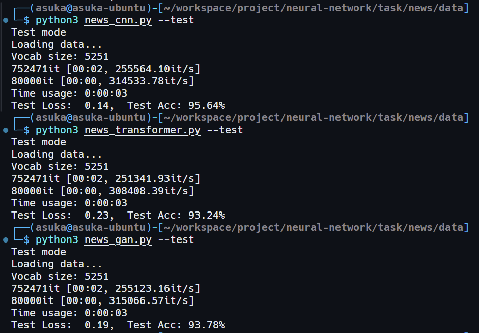
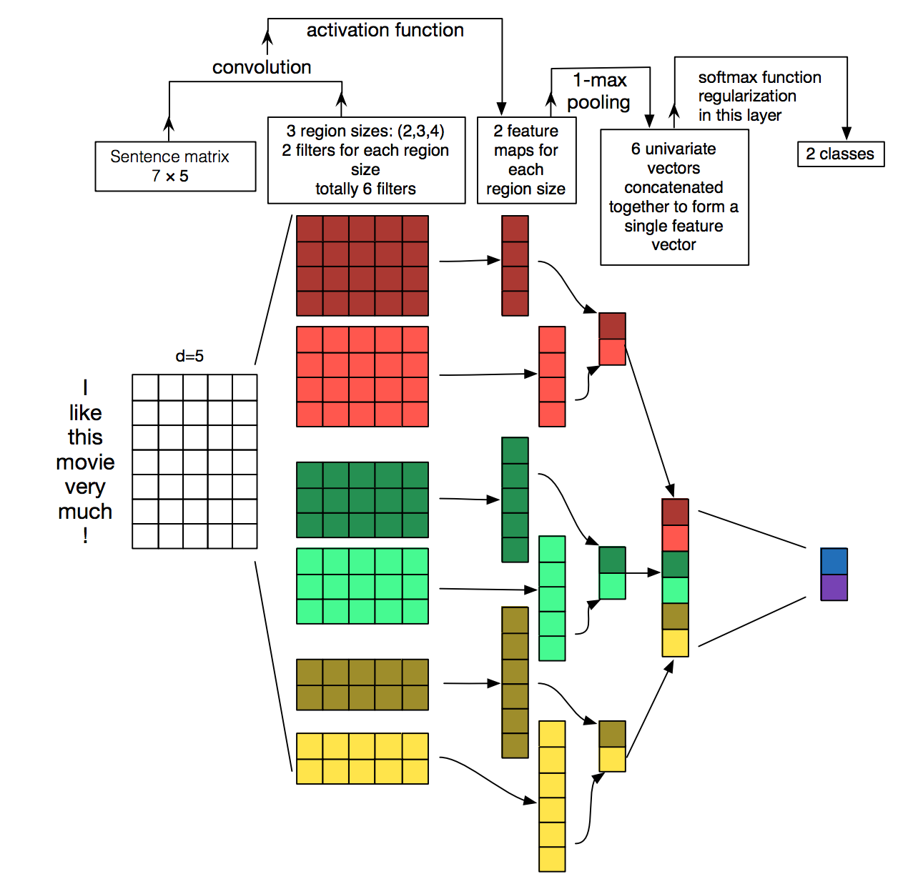
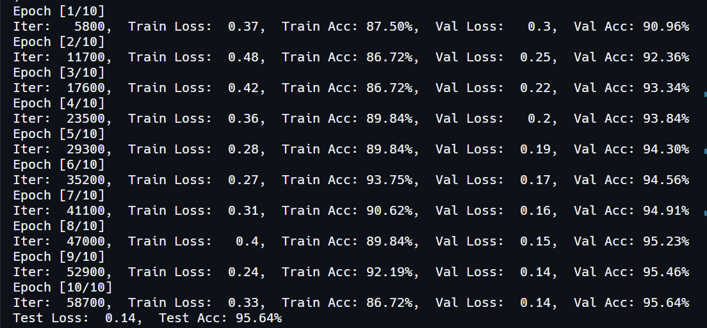
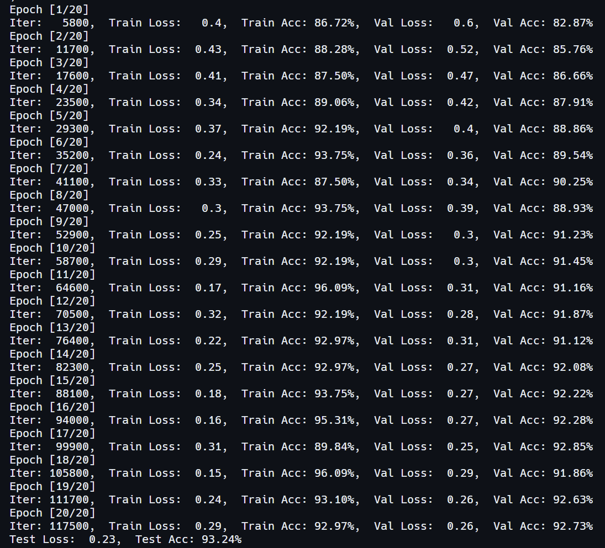
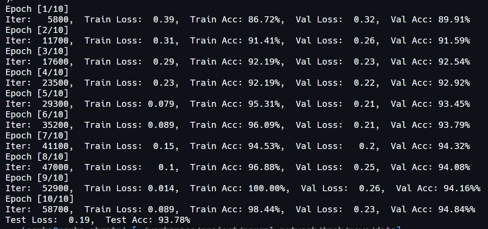

# 新闻标题分类

## 实验目的和要求

**任务简介：** 根据所学的人工神经网络的知识对 14 种新闻标题进行分类，属于 NLP 方向经典的文本分类任务。文本分类是计算机自然语言处理领域的一个基本任务，其目标是将输入的文本内容分配给某个预定义的类别（即标签）

**数据集介绍：**数据集包含训练集、测试集和验证集。标签类别有：'财经'，'科技'，'时政'，'房产'，'社会'，'游戏'，'家居'，'时尚'，'股票'，'彩票'，'娱乐'，'教育'，'星座'，'体育'

**目的：** 考察学生对于人工神经网络课程的学习情况 

**任务要求：** 

1. 分别使用CNN 网络以及 Transformer 网络实现 2 种不同的基于深度学习的识别方式，可以使用预训练模型，在Dev 上的识别率大于等于0.95，不建议使用参数量和计算量比较大的模型，使用 pytorch 和 paddle 框架都可以
2. 撰写实验报告
3. 使用 GAN 网络进行实现（拓展内容）

## 使用方式

- 项目地址：https://github.com/ASUKA39/SYSU-ANNs-Term-Project.git

- 操作系统：Ubuntu 22.04 LTS

- Python 依赖库：

  - pytorch
  - numpy
  - scikit-learn
  - tqdm

- 目录结构：数据集、代码和模型权重均位于同一级目录

- 模型权重：

- 运行：

  ```shell
  python3 <script_name>.py --test		# 测试
  python3 <script_name>.py			# 训练并测试
  ```



## CNN

### 简介

卷积神经网络（CNN）是一种前馈神经网络，它的人工神经元可以响应一部分覆盖范围内的周围单元，卷积神经网络对于大型图像处理有出色表现

卷积神经网络由一个或多个卷积层和顶端的全连通层（对应经典的神经网络）组成，同时也包括关联权重和池化层。这一结构使得卷积神经网络能够利用输入数据的二维结构

卷积神经网络由输入层、隐藏层和输出层组成。卷积神经网络通常由三个主要部分组成：输入层、隐藏层和输出层。在输入层，网络接收来自图像、音频或其他类型数据的原始输入。然后，通过一系列卷积层，网络可以自动提取输入数据中的特征，这些特征可以识别出图像中的边缘、纹理和其他重要信息。接着，通过池化层，网络可以减小数据的维度，降低计算复杂度，同时保留重要的信息。卷积神经网络的输出层通常用于进行最终的分类或回归任务。这个层级将前面隐藏层提取的特征映射到网络的最终输出，例如，对图像进行分类或对语音进行识别

TextCNN是一种用于文本分类和文本情感分析的深度学习模型，它基于卷积神经网络（CNN）的思想，旨在捕获文本数据中的局部特征和语义信息。TextCNN 的核心思想是通过一维卷积操作和池化层来提取不同长度的文本特征，然后将这些特征组合在一起进行分类。模型的输入是文本数据的词嵌入表示，通过卷积核在不同位置进行滑动，从而捕获文本中的局部信息，接着使用池化操作（通常是最大池化）对每个卷积特征图提取的特征进行降维，最后将这些特征连接在一起，送入全连接层进行分类。TextCNN具有轻量化的特点，能够有效地处理文本数据，常用于文本分类任务，如情感分析、垃圾邮件过滤、新闻分类等，且在许多实际应用中取得了良好的性能



### 代码实现

首先导入所需要的库和函数，然后列出文本分类类别的列表 `class_list`，这是因为我们的数据集中标题都是以文字形式出现，这里需要用列表序号映射这些文字才能被作为模型输入

```python
import time
import os
import numpy as np
import torch
import torch.nn as nn
import torch.nn.functional as F
import pickle as pkl
from tqdm import tqdm
from datetime import timedelta
from sklearn import metrics

class_list = ['财经', '科技', '时政', '房产', '社会', '游戏', '家居', '时尚', '股票', '彩票', '娱乐', '教育', '星座', '体育']
MAX_VOCAB_SIZE = 10000
UNK, PAD = '<UNK>', '<PAD>'
torch.cuda.set_device(0)
```

然后对训练数据和验证数据进行了预处理，将原始的标签映射为序号，并另外保存为文本文件 `train_process.txt` 和 `dev_process.txt`，方便处理

```python
if not os.path.exists('./train_process.txt'):
    with open('./train.txt', 'r', encoding='UTF-8') as f:
        with open('./train_process.txt', 'w', encoding='UTF-8') as f2:
            for line in f:
                lin = line.strip()
                if not lin:
                    continue
                content, label = lin.split('\t')
                f2.write(content + '\t' + str(class_list.index(label)) + '\n')

if not os.path.exists('./dev_process.txt'):
    with open('./dev.txt', 'r', encoding='UTF-8') as f:
        with open('./dev_process.txt', 'w', encoding='UTF-8') as f2:
            for line in f:
                lin = line.strip()
                if not lin:
                    continue
                content, label = lin.split('\t')
                f2.write(content + '\t' + str(class_list.index(label)) + '\n')
```

`build_dataset`函数用于构建数据集，并加载词汇表和预训练词向量，`build_iterator`函数用于生成数据迭代器。`build_dataset`首先将句子按字符切分，然后调用`build_vocab`，最后将文本内容转换为词语列表或字符列表，然后进行填充或截断，将词语或字符转换为对应的词汇表编号，最后保存成元组；`build_vocab`函数则负责构建词汇表，其对数据集中的句子进行分词操作，统计词语出现次数，然后按照出现次数排序，最终生成一个包含词语和对应整数编号的词汇表，未知词语和填充字符则用`UNK`和`PAD`表示

```python
def build_dataset(config, ues_word):
    if ues_word:
        tokenizer = lambda x: x.split(' ')
    else:
        tokenizer = lambda x: [y for y in x]
    if os.path.exists(config.vocab_path):
        vocab = pkl.load(open(config.vocab_path, 'rb'))
    else:
        vocab = build_vocab(config.train_path, tokenizer=tokenizer, max_size=MAX_VOCAB_SIZE, min_freq=1)
        pkl.dump(vocab, open(config.vocab_path, 'wb'))
    print(f"Vocab size: {len(vocab)}")

    def load_dataset(path, pad_size=32):
        contents = []
        with open(path, 'r', encoding='UTF-8') as f:
            for line in tqdm(f):
                lin = line.strip()
                if not lin:
                    continue
                content, label = lin.split('\t')
                words_line = []
                token = tokenizer(content)
                seq_len = len(token)
                if pad_size:
                    if len(token) < pad_size:
                        token.extend([PAD] * (pad_size - len(token)))
                    else:
                        token = token[:pad_size]
                        seq_len = pad_size
                for word in token:
                    words_line.append(vocab.get(word, vocab.get(UNK)))
                contents.append((words_line, int(label), seq_len))
        return contents

    train = load_dataset(config.train_path, config.pad_size)
    dev = load_dataset(config.dev_path, config.pad_size)
    # test = load_dataset(config.test_path, config.pad_size)
    return vocab, train, dev

def build_iterator(dataset, config):
    iter = DatasetIterater(dataset, config.batch_size, config.device)
    return iter

def build_vocab(file_path, tokenizer, max_size, min_freq):
    vocab_dic = {}
    with open(file_path, 'r', encoding='UTF-8') as f:
        for line in tqdm(f):
            lin = line.strip()
            if not lin:
                continue
            content = lin.split('\t')[0]
            for word in tokenizer(content):
                vocab_dic[word] = vocab_dic.get(word, 0) + 1
        vocab_list = sorted([_ for _ in vocab_dic.items() if _[1] >= min_freq], key=lambda x: x[1], reverse=True)[:max_size]
        vocab_dic = {word_count[0]: idx for idx, word_count in enumerate(vocab_list)}
        vocab_dic.update({UNK: len(vocab_dic), PAD: len(vocab_dic) + 1})
    return vocab_dic
```

`Config` 类用于存储模型的配置信息，包括模型名称、词汇表路径、训练数据路径、设备选择、超参数设置等

```python
class Config(object):
    def __init__(self, dataset, embedding):
        self.model_name = 'news_TextCNN'
        self.class_list = class_list
        self.vocab_path = os.path.join(dataset, './vocab.pkl')
        self.train_path = os.path.join(dataset, './train_process.txt')
        self.dev_path = os.path.join(dataset, './dev_process.txt')
        self.test_path = os.path.join(dataset, './test.txt')
        self.save_path = os.path.join(dataset, './', self.model_name + '.ckpt')
        self.log_path = os.path.join(dataset, 'log', self.model_name)
        self.embedding_pretrained = torch.tensor(
            np.load(os.path.join(dataset, 'data', embedding))["embeddings"].astype('float32'))\
            if embedding != 'random' else None
        self.device = torch.device('cuda' if torch.cuda.is_available() else 'cpu')
        self.dropout = 0.5
        self.require_improvement = 1000
        self.num_classes = len(self.class_list)
        self.num_epochs = 10
        self.batch_size = 128
        self.pad_size = 32
        self.learning_rate = 1e-3
        self.embed = self.embedding_pretrained.size(1)\
            if self.embedding_pretrained is not None else 300
        self.filter_sizes = (2, 3, 4)
        self.num_filters = 256
```

`DatasetIterater` 类用于生成数据批次，通过迭代获取训练数据和标签

```python
class DatasetIterater(object):
    def __init__(self, batches, batch_size, device):
        self.batch_size = batch_size
        self.batches = batches
        self.n_batches = len(batches) // batch_size
        self.residue = False
        if len(batches) % self.n_batches != 0:
            self.residue = True
        self.index = 0
        self.device = device

    def _to_tensor(self, datas):
        x = torch.LongTensor([_[0] for _ in datas]).to(self.device)
        y = torch.LongTensor([_[1] for _ in datas]).to(self.device)
        seq_len = torch.LongTensor([_[2] for _ in datas]).to(self.device)
        return (x, seq_len), y

    def __next__(self):
        if self.residue and self.index == self.n_batches:
            batches = self.batches[self.index * self.batch_size: len(self.batches)]
            self.index += 1
            batches = self._to_tensor(batches)
            return batches
        elif self.index >= self.n_batches:
            self.index = 0
            raise StopIteration
        else:
            batches = self.batches[self.index * self.batch_size: (self.index + 1) * self.batch_size]
            self.index += 1
            batches = self._to_tensor(batches)
            return batches

    def __iter__(self):
        return self

    def __len__(self):
        if self.residue:
            return self.n_batches + 1
        else:
            return self.n_batches
```

然后定义 TextCNN 网络结构，包括文本数据的嵌入层、多个卷积层、池化层、Dropout 层和全连接层

```python
class TextCNN(nn.Module):
    def __init__(self, config):
        super(TextCNN, self).__init__()
        self.embedding = nn.Embedding.from_pretrained(config.embedding_pretrained, freeze=False) \
            if config.embedding_pretrained is not None else nn.Embedding(config.n_vocab, config.embed, padding_idx=config.n_vocab - 1)
        self.convs = nn.ModuleList(
            [nn.Conv2d(1, config.num_filters, (k, config.embed)) for k in config.filter_sizes])
        self.dropout = nn.Dropout(config.dropout)
        self.fc = nn.Linear(config.num_filters * len(config.filter_sizes), config.num_classes)

    def conv_and_pool(self, x, conv):
        x = F.relu(conv(x)).squeeze(3)
        x = F.max_pool1d(x, x.size(2)).squeeze(2)
        return x

    def forward(self, x):
        out = self.embedding(x[0])
        out = out.unsqueeze(1)
        out = torch.cat([self.conv_and_pool(out, conv) for conv in self.convs], 1)
        out = self.dropout(out)
        out = self.fc(out)
        return out
```

然后是一些工具函数，`init_network`用于初始化模型的权重参数， `get_time_dif` 用于计算训练或测试时间

```python
def init_network(model, method='xavier', exclude='embedding', seed=123):
    for name, w in model.named_parameters():
        if exclude not in name:
            if 'weight' in name:
                if method == 'xavier':
                    nn.init.xavier_normal_(w)
                elif method == 'kaiming':
                    nn.init.kaiming_normal_(w)
                else:
                    nn.init.normal_(w)
            elif 'bias' in name:
                nn.init.constant_(w, 0)
            else:
                pass

def get_time_dif(start_time):
    end_time = time.time()
    time_dif = end_time - start_time
    return timedelta(seconds=int(round(time_dif)))
```

`evaluate` 函数用于评估模型在验证集或测试集上的性能，包括计算准确率、损失、分类报告和混淆矩阵等; `model_test` 函数用于在测试集上评估模型的性能

```python
def evaluate(config, model, data_iter, test=False):
    model.eval()
    loss_total = 0
    predict_all = np.array([], dtype=int)
    labels_all = np.array([], dtype=int)
    with torch.no_grad():
        for texts, labels in data_iter:
            outputs = model(texts)
            loss = F.cross_entropy(outputs, labels)
            loss_total += loss
            labels = labels.data.cpu().numpy()
            predic = torch.max(outputs.data, 1)[1].cpu().numpy()
            labels_all = np.append(labels_all, labels)
            predict_all = np.append(predict_all, predic)

    acc = metrics.accuracy_score(labels_all, predict_all)
    if test:
        report = metrics.classification_report(labels_all, predict_all, target_names=config.class_list, digits=4)
        confusion = metrics.confusion_matrix(labels_all, predict_all)
        return acc, loss_total / len(data_iter), report, confusion
    return acc, loss_total / len(data_iter)

def model_test(config, model, test_iter):
    model.load_state_dict(torch.load(config.save_path))
    model.eval()
    test_acc, test_loss, test_report, test_confusion = evaluate(config, model, test_iter, test=True)
    msg = 'Test Loss: {0:>5.2},  Test Acc: {1:>6.2%}'
    print(msg.format(test_loss, test_acc))
```

 `train`函数用于训练模型，这里使用交叉熵损失函数进行优化

```python
def train(config, model, train_iter, dev_iter):
    model.train()
    optimizer = torch.optim.Adam(model.parameters(), lr=config.learning_rate)
    total_batch = 0
    dev_best_loss = float('inf')
    
    for epoch in range(config.num_epochs):
        print('Epoch [{}/{}]'.format(epoch + 1, config.num_epochs))
        for i, (trains, labels) in enumerate(train_iter):
            outputs = model(trains)
            model.zero_grad()
            loss = F.cross_entropy(outputs, labels)
            loss.backward()
            optimizer.step()

            if total_batch % 100 == 0:
                true = labels.data.cpu()
                predic = torch.max(outputs.data, 1)[1].cpu()
                train_acc = metrics.accuracy_score(true, predic)
                dev_acc, dev_loss = evaluate(config, model, dev_iter)

                if dev_loss < dev_best_loss:
                    dev_best_loss = dev_loss
                    torch.save(model.state_dict(), "TextCNN.ckpt")

                msg = '\rIter: {0:>6},  Train Loss: {1:>5.2},  Train Acc: {2:>6.2%},  Val Loss: {3:>5.2},  Val Acc: {4:>6.2%}'
                print(msg.format(total_batch, loss.item(), train_acc, dev_loss, dev_acc), end='')
                model.train()
            total_batch += 1
        print()
```

最后，在 `__main__` 部分，加载数据、构建模型、初始化权重参数，并进行训练和测试。模型在验证集上的性能将在训练过程中定期进行评估，并保存最佳模型参数

```python
if __name__ == "__main__":
    dataset = ''
    model_name = 'TextCNN'
    embedding = 'random'
    config = Config(dataset, embedding)
    np.random.seed(1)
    torch.manual_seed(1)
    torch.cuda.manual_seed_all(1)
    torch.backends.cudnn.deterministic = True
    start_time = time.time()

    print("Loading data...")
    vocab, train_data, dev_data = build_dataset(config, False)
    train_iter = build_iterator(train_data, config)
    dev_iter = build_iterator(dev_data, config)
    time_dif = get_time_dif(start_time)

    print("Time usage:", time_dif)

    config.n_vocab = len(vocab)
    model = TextCNN(config).to(config.device)
    init_network(model)
    print(model.parameters)

    train(config, model, train_iter, dev_iter)
    model_test(config, model, dev_iter)
```

### 实验结果



- 可见，模型在迭代十轮后分类准确率可以达到 95% 左右

## Transformer

### 简介

Transformer 是一种强大的神经网络架构，其被广泛应用于自然语言处理（NLP）和其他序列数据处理任务，也可以用于部分分类任务。相对于传统的循环神经网络（RNN）和卷积神经网络（CNN），Transformer 采用了完全不同的结构，通过注意力机制来实现序列建模。其核心思想是自注意力机制，允许模型同时考虑输入序列中的所有位置，从而解决了长距离依赖性问题

Transformer 由编码器和解码器组成，每个编码器和解码器均包含多个注意力头。在编码器中，输入序列经过多头注意力层和前馈神经网络层，每个注意力头都能学习不同的关系。在解码器中，除了编码器的自注意力机制，还包含了一个注意力机制来处理输入序列的信息，以及前馈神经网络用于生成输出序列。Transformer 的模型结构可以轻松地扩展到处理不同长度的输入和输出序列，具有很强的通用性

由于 Transformer 天然适合自然语言处理任务，所以本次项目直接使用 Transformer 即可

### 代码实现

模块和函数导入、数据集读取、DataLoader、模型训练和验证等均与上面的 TextCNN 一致，这里主要介绍模型结构


1. `transformer`类包含了整个 Transformer 模型的定义。它包括了嵌入层（Embedding Layer）、位置编码层（Positional_Encoding）、多层编码器（Encoder）以及输出层。其中，嵌入层用于将输入的文本数据转换成向量表示，位置编码层用于引入序列信息，多层编码器包含多个Encoder的堆叠，用于提取特征信息，最后的全连接层用于输出分类结果
2. `Encoder`类是Transformer中的编码器模块，包含了多头自注意力机制和前馈神经网络。编码器用于对输入进行特征提取和表示学习
3. `Positional_Encoding`类是位置编码模块，用于为输入的文本序列引入位置信息。位置编码是通过一些预定义的数学公式计算的，然后与输入的词嵌入相加以得到带有位置信息的词向量
4. `Scaled_Dot_Product_Attention`类是自注意力机制模块，用于计算注意力权重并生成上下文向量，其接受查询（Q）、键（K）、值（V）作为输入，并根据它们的相似度来计算上下文向量
5. `Multi_Head_Attention`类是多头自注意力机制模块，其将多个注意力头组合起来，以提高模型对不同特征的学习能力。它包括线性映射层和残差连接
6. `Position_wise_Feed_Forward`类前馈神经网络，用于对每个位置的特征进行非线性变换和整合。它包括两个线性层、ReLU激活函数、残差连接和层归一化

```python
class transformer(nn.Module):
    def __init__(self, config):
        super(transformer, self).__init__()
        if config.embedding_pretrained is not None:
            self.embedding = nn.Embedding.from_pretrained(config.embedding_pretrained, freeze=False)
        else:
            self.embedding = nn.Embedding(config.n_vocab, config.embed, padding_idx=config.n_vocab - 1)
        self.postion_embedding = Positional_Encoding(config.embed, config.pad_size, config.dropout, config.device)
        self.encoder = Encoder(config.dim_model, config.num_head, config.hidden, config.dropout)
        self.encoders = nn.ModuleList([copy.deepcopy(self.encoder) for _ in range(config.num_encoder)])
        self.fc1 = nn.Linear(config.pad_size * config.dim_model, config.num_classes)

    def forward(self, x):
        out = self.embedding(x[0])
        out = self.postion_embedding(out)
        for encoder in self.encoders:
            out = encoder(out)
        out = out.view(out.size(0), -1)
        out = self.fc1(out)
        return out

class Encoder(nn.Module):
    def __init__(self, dim_model, num_head, hidden, dropout):
        super(Encoder, self).__init__()
        self.attention = Multi_Head_Attention(dim_model, num_head, dropout)
        self.feed_forward = Position_wise_Feed_Forward(dim_model, hidden, dropout)

    def forward(self, x):
        out = self.attention(x)
        out = self.feed_forward(out)
        return out

class Positional_Encoding(nn.Module):
    def __init__(self, embed, pad_size, dropout, device):
        super(Positional_Encoding, self).__init__()
        self.device = device
        self.pe = torch.tensor([[pos / (10000.0 ** (i // 2 * 2.0 / embed)) for i in range(embed)] for pos in range(pad_size)])
        self.pe[:, 0::2] = np.sin(self.pe[:, 0::2])
        self.pe[:, 1::2] = np.cos(self.pe[:, 1::2])
        self.dropout = nn.Dropout(dropout)

    def forward(self, x):
        out = x + nn.Parameter(self.pe, requires_grad=False).to(self.device)
        out = self.dropout(out)
        return out

class Scaled_Dot_Product_Attention(nn.Module):
    def __init__(self):
        super(Scaled_Dot_Product_Attention, self).__init__()

    def forward(self, Q, K, V, scale=None):
        attention = torch.matmul(Q, K.permute(0, 2, 1))
        if scale:
            attention = attention * scale
        attention = F.softmax(attention, dim=-1)
        context = torch.matmul(attention, V)
        return context

class Multi_Head_Attention(nn.Module):
    def __init__(self, dim_model, num_head, dropout=0.0):
        super(Multi_Head_Attention, self).__init__()
        self.num_head = num_head
        assert dim_model % num_head == 0
        self.dim_head = dim_model // self.num_head
        self.fc_Q = nn.Linear(dim_model, num_head * self.dim_head)
        self.fc_K = nn.Linear(dim_model, num_head * self.dim_head)
        self.fc_V = nn.Linear(dim_model, num_head * self.dim_head)
        self.attention = Scaled_Dot_Product_Attention()
        self.fc = nn.Linear(num_head * self.dim_head, dim_model)
        self.dropout = nn.Dropout(dropout)
        self.layer_norm = nn.LayerNorm(dim_model)

    def forward(self, x):
        batch_size = x.size(0)
        Q = self.fc_Q(x)
        K = self.fc_K(x)
        V = self.fc_V(x)
        Q = Q.view(batch_size * self.num_head, -1, self.dim_head)
        K = K.view(batch_size * self.num_head, -1, self.dim_head)
        V = V.view(batch_size * self.num_head, -1, self.dim_head)

        scale = K.size(-1) ** -0.5
        context = self.attention(Q, K, V, scale)

        context = context.view(batch_size, -1, self.dim_head * self.num_head)
        out = self.fc(context)
        out = self.dropout(out)
        out = out + x
        out = self.layer_norm(out)
        return out

class Position_wise_Feed_Forward(nn.Module):
    def __init__(self, dim_model, hidden, dropout=0.0):
        super(Position_wise_Feed_Forward, self).__init__()
        self.fc1 = nn.Linear(dim_model, hidden)
        self.fc2 = nn.Linear(hidden, dim_model)
        self.dropout = nn.Dropout(dropout)
        self.layer_norm = nn.LayerNorm(dim_model)

    def forward(self, x):
        out = self.fc1(x)
        out = F.relu(out)
        out = self.fc2(out)
        out = self.dropout(out)
        out = out + x
        out = self.layer_norm(out)
        return out
```

### 实验结果



- 可见，经过 20 轮迭代后模型分类正确率能达到 93% 左右

## GAN

### 简介

生成对抗网络（GAN）是一种深度学习架构。该架构训练两个神经网络相互竞争，从而从给定的训练数据集生成更真实的新数据。例如，您可以从现有图像数据库生成新图像，也可以从歌曲数据库生成原创音乐。GAN 之所以被称为对抗网络，是因为该架构训练两个不同的网络并使其相互对抗。一个网络通过获取输入数据样本并尽可能对其进行修改来生成新数据。另一个网络尝试预测生成的数据输出是否属于原始数据集。换句话说，预测网络决定生成的数据是假的还是真的。系统会生成更新、改进版本的假数据值，直到预测网络不再能够区分假数据值和原始数据值

生成对抗网络系统包括两个深度神经网络 — 生成器网络和辨别器网络。其中一个网络尝试生成新数据，另一个网络尝试预测输出是虚假数据还是真实数据。生成器尝试最大限度地提高辨别者出错的可能性，而辨别器会尝试最大限度地降低出错的可能性。在训练迭代中，生成器和辨别器会不断演变并相互对抗，直到它们达到平衡状态。在平衡状态下，辨别者无法再识别合成数据，至此训练过程结束


本次项目中，判别器负责区分真实文本和生成的假文本，并通过交叉熵损失进行训练，同时生成器通过生成逼真的假文本来迷惑判别器，也进行交叉熵损失的训练。通过这种对抗性训练，模型逐渐提高了文本分类的准确率和鲁棒性

### 代码实现

模块和函数导入、数据集读取、DataLoader、模型训练和验证等均与上面的 TextCNN 与 transformer 一致，这里主要介绍模型结构和训练过程

判别器`Discriminator`是一个简单的 CNN 模型，接受文本输入，经过嵌入、卷积和全连接层处理后输出分类结果，用于区分真实文本和生成的假文本；生成器`Generator`接受随机噪声输入，通过全连接层将其映射成文本表示，用于生成假文本

```python
class Discriminator(nn.Module):
    def __init__(self):
        super(Discriminator, self).__init__()
        self.embedding = nn.Embedding(num_vocab, 300, padding_idx=num_vocab - 1)
        self.conv1 = nn.Conv1d(32, 64, kernel_size=3, stride=2, padding=1)
        self.conv2 = nn.Conv1d(64, 128, kernel_size=3, stride=2, padding=1)
        self.flatten = nn.Flatten()
        self.fc = nn.Linear(9600, num_class)

    def forward(self, x):
        if(isinstance(x, tuple)):
            x = self.embedding(x[0])
        x = F.relu(self.conv1(x))
        x = F.relu(self.conv2(x))
        x = self.flatten(x)
        x = self.fc(x)
        return x

class Generator(nn.Module):
    def __init__(self):
        super(Generator, self).__init__()
        self.fc = nn.Linear(100, 32 * 300)
        
    def forward(self, x):
        x = self.fc(x)
        x = x.view(-1, 32, 300)
        return x
```

在每个训练步骤中，首先 Discriminator 对一批真实文本进行前向传播，并计算损失（真实文本的损失）。接着使用 Generator 生成一批假文本，将这些假文本传递给 Discriminator 进行前向传播，然后计算损失（假文本的损失）。Discriminator 根据真实文本和假文本的损失来更新自身的权重参数，它会尽量减小真实文本的损失并增大假文本的损失，以提高对真伪文本的判断能力，最终模型获得一定的鲁棒性

```python
def train(config, discriminator, generator, train_iter, dev_iter):
    discriminator.train()
    optimizer = torch.optim.Adam(discriminator.parameters(), lr=config.learning_rate)
    total_batch = 0
    dev_best_loss = float('inf')
    device = torch.device('cuda' if torch.cuda.is_available() else 'cpu')
    
    for epoch in range(config.num_epochs):
        print('Epoch [{}/{}]'.format(epoch + 1, config.num_epochs))
        for i, (trains, labels) in enumerate(train_iter):
            outputs = discriminator(trains)
            discriminator.zero_grad()
            loss = F.cross_entropy(outputs, labels)
            loss.backward()
            optimizer.step()

            random_noise = torch.randn(128, 100).to(device)
            fake_data = generator(random_noise)
            fake_labels = torch.randint(0, num_class, (128,)).to(device)

            fake_outputs = discriminator(fake_data.detach())
            fake_loss = F.cross_entropy(fake_outputs, fake_labels)
            fake_loss.backward()
            optimizer.step()

            if total_batch % 100 == 0:
                true = labels.data.cpu()
                predic = torch.max(outputs.data, 1)[1].cpu()
                train_acc = metrics.accuracy_score(true, predic)
                dev_acc, dev_loss = evaluate(config, discriminator, generator, dev_iter)
                if dev_loss < dev_best_loss:
                    dev_best_loss = dev_loss
                    torch.save(discriminator.state_dict(), "news_GAN.ckpt")
                msg = '\rIter: {0:>6},  Train Loss: {1:>5.2},  Train Acc: {2:>6.2%},  Val Loss: {3:>5.2},  Val Acc: {4:>6.2%}'
                print(msg.format(total_batch, loss.item(), train_acc, dev_loss, dev_acc), end='')
                discriminator.train()
            total_batch += 1
        print()
```

### 实验结果



- 可见，在迭代十轮后模型在训练集的损失降低到 0.01 以下，在测试集上的准确率可以达到 94% 左右

## 实验结论与体会

- 在本次项目中，我分别使用了 CNN（TextCNN）、Transformer 和 GAN 对十四种新闻标题进行分类，在没有使用预训练模型参数的情况下三种模型在测试集上均取得了 90% 以上的正确率
- CNN 模型 TextCNN 在文本分类任务中表现优异，因为其能够有效地捕捉文本中的局部特征和高级语义信息，通过卷积操作和池化操作对文本进行特征提取和降维，使得模型能够学习到文本中不同长度的关键特征，同时具备一定的平移不变性。这种结构简单而有效的设计使得TextCNN在文本分类任务中具有较高的性能和泛化能力，同时能够适用于不同长度的文本数据。此外，CNN 的训练和运行速度相比于其他模型而言非常快，分类的准确率在本项目中最高
- Transformer 模型同样表现优异，其独有的自注意力机制能够捕捉文本中长距离的依赖关系和上下文信息，使模型能够更好地理解文本内容。此外，Transformer 模型采用的多头注意力机制可以同时关注文本的多个方面，有助于提取更丰富的语义特征。另外，位置编码、残差连接等设计同样有助于模型更好地处理文本序列。Transformer 模型在本次项目中训练速度略慢于 TextCNN，但准确率与 TextCNN 相近
- GAN 模型可以通过生成器进行数据增广，可以很好地丰富数据集，弥补语言数据集不足的缺点，同时也可以采用对抗训练的方式，生成有一定随机性的噪声，增强鉴别器的鲁棒性，使其有更好的泛用性和迁移性。在本次项目中，训练得的鉴别器也取得了与 Transformer 相近的准确率
- 通过这次实验，我对深度学习在自然语言分类任务中的应用有了更深的理解，同时也提高了代码实践的技能，为未来在深度学习领域的学习和实践奠定了更好的基础