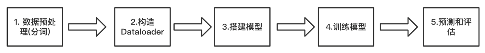
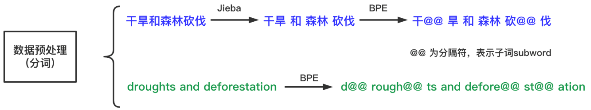
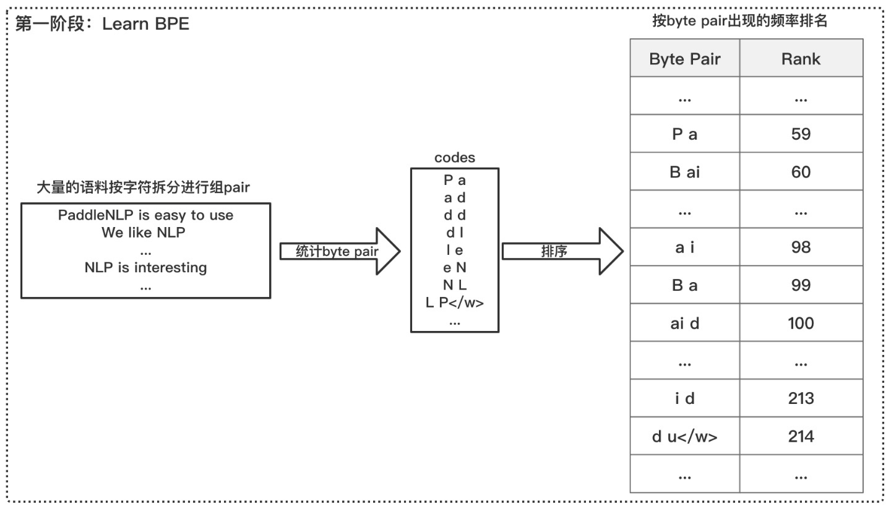
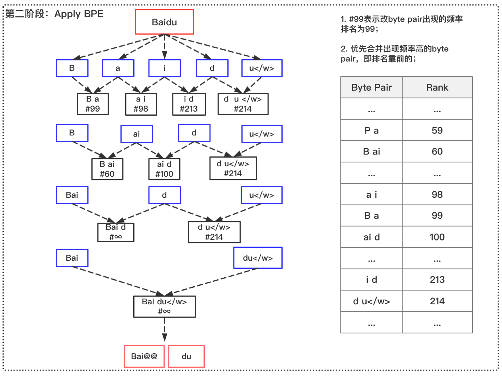
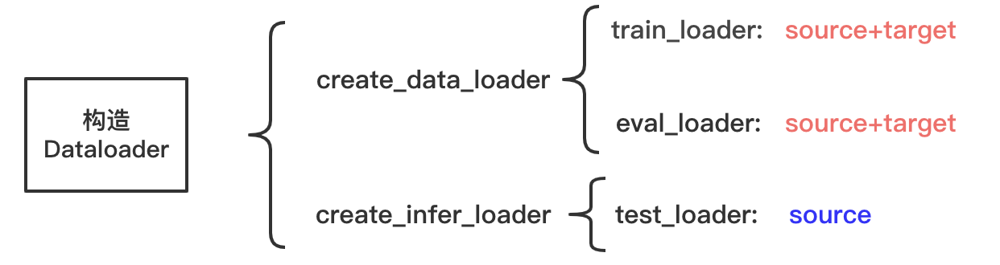
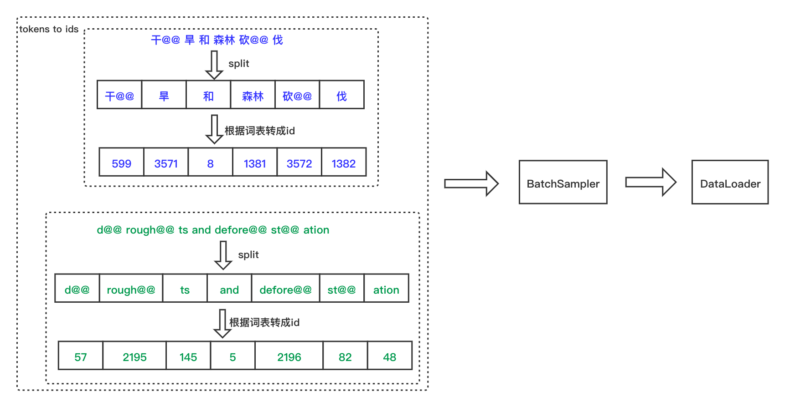
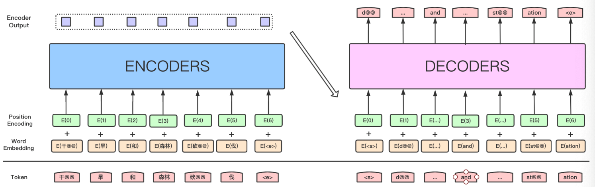
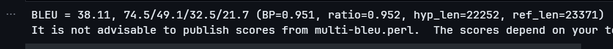

# 中英文翻译

## 实验目的和要求

**任务简介：** 根据所学的人工神经网络的知识进行中英文翻译，属于 NLP 方向经典的机器翻译任务，机器翻译是利用计算机将一种自然语言（源语言）转为另一种自然语言(目标语言)的过程。

**参考项目：** https://aistudio.baidu.com/projectdetail/2496060?channelType=0&channel=0 

**数据集介绍：** 本项目使用 CWMT 数据集中的中文英文的数据作为训练语料，CWMT 数据集在 900 万+，质量较高，非常适合来训练 Transformer 机器翻译。

**目的：** 考察学生对于人工神经网络课程呢的学习情况 

**任务要求：** 

1. 使用 Transformer 网络实现基于深度学习的识别方式，可以使用预训练模型，不建议使用参数量和计算量比较大的模型，使用 pytorch 和paddle 框架都可以
2. 撰写实验报告
3. 使用 CNN 网络进行实现（拓展内容）

## 使用方式

- 项目地址：https://github.com/ASUKA39/SYSU-ANNs-Term-Project.git
- 百度飞桨：https://aistudio.baidu.com/projectdetail/7401502?contributionType=1&sUid=2570022&shared=1&ts=1705140705007

## 简介

Transformer 是一种强大的神经网络架构，其被广泛应用于自然语言处理（NLP）和其他序列数据处理任务，也可以用于部分分类任务。相对于传统的循环神经网络（RNN）和卷积神经网络（CNN），Transformer 采用了完全不同的结构，通过注意力机制来实现序列建模。其核心思想是自注意力机制，允许模型同时考虑输入序列中的所有位置，从而解决了长距离依赖性问题

Transformer 由编码器和解码器组成，每个编码器和解码器均包含多个注意力头。在编码器中，输入序列经过多头注意力层和前馈神经网络层，每个注意力头都能学习不同的关系。在解码器中，除了编码器的自注意力机制，还包含了一个注意力机制来处理输入序列的信息，以及前馈神经网络用于生成输出序列。Transformer 的模型结构可以轻松地扩展到处理不同长度的输入和输出序列，具有很强的通用性


在执行中英文翻译任务时，我们首先需要准备中英文的平行语料库。这个语料库包含了成对的中英文句子，作为训练模型的基础数据。接下来，进行数据预处理，这一步骤包括对语料中的中英文进行分词操作，以及构建相应的词汇表，这样才能将自然语言转换为机器可处理的形式。Transformer 模型由编码器（Encoder）和解码器（Decoder）组成。Transformer 模型的一个关键特点是通过位置嵌入（Positional Encoding）来处理词序信息，这对于理解自然语言至关重要。将中英文文本转换成嵌入向量后，模型便以这些向量为输入。在处理输入时，Transformer 使用自注意力机制使得模型能够有效地捕捉文本中的长距离依赖关系。在训练阶段，模型通过监督学习的方式，使用平行语料对自身进行训练。这个过程中，我们不断调整超参数，以提升模型的翻译性能。训练完成后，就可以利用这个训练有素的模型来进行翻译任务，它通过生成目标语言的概率分布来产生翻译结果。Transformer 模型在中英文翻译任务中表现出的优势主要是其对长距离依赖关系的高效处理能力。自注意力机制使得模型能够并行计算全局信息，这可以一定程度上加速训练过程

## 代码实现

本此项目基于 paddle 框架，项目运行于百度飞桨，整体流程如下



首先引入依赖库

```python
import os
import time
import yaml
import logging
import argparse
import numpy as np
from pprint import pprint
from attrdict import AttrDict
import jieba

import numpy as np
from functools import partial
import paddle
import paddle.nn as nn
import paddle.nn.functional as F
import paddle.distributed as dist
from paddle.io import DataLoader,BatchSampler
from paddlenlp.data import Vocab, Pad
from paddlenlp.datasets import load_dataset
from paddlenlp.transformers import *
from paddlenlp.utils.log import logger

from utils import post_process_seq
```

然后进行分词。中文的分词处理需要用到 Jieba 和 BPE（Byte Pair Encoding）两种方案，因为中文是连续无空格的，所以需要先在词与词之间进行划分，所以需要首先用 Jieba 对句子进行分词，然后使用 BPE 进行分隔子词。BPE 每一步都将最常见的一对相邻数据单位替换为该数据中没有出现过的一个新单位，反复迭代直到满足停止条件。BPE 可以对词表大小进行压缩，还可以一定程度上缓解 OOV（Out Of Vocabulary）问题



BPE 流程如下





然后构造 Dataloader。`create_data_loader`函数负责创建训练集、验证集所需要的`DataLoader`对象,  `create_infer_loader`函数则负责创建预测集所需要的`DataLoader`对象，下图是整体流程





```python
def read(src_path, tgt_path, is_predict=False):
    if is_predict:
        with open(src_path, 'r', encoding='utf8') as src_f:
            for src_line in src_f.readlines():
                src_line = src_line.strip()
                if not src_line:
                    continue
                yield {'src':src_line, 'tgt':''}
    else:
        with open(src_path, 'r', encoding='utf8') as src_f, open(tgt_path, 'r', encoding='utf8') as tgt_f:
            for src_line, tgt_line in zip(src_f.readlines(), tgt_f.readlines()):
                src_line = src_line.strip()
                if not src_line:
                    continue
                tgt_line = tgt_line.strip()
                if not tgt_line:
                    continue
                yield {'src':src_line, 'tgt':tgt_line}
          
def min_max_filer(data, max_len, min_len=0):

    data_min_len = min(len(data[0]), len(data[1])) + 1
    data_max_len = max(len(data[0]), len(data[1])) + 1
    return (data_min_len >= min_len) and (data_max_len <= max_len)
```

以下是 Dataloader 的实现。首先加载训练集和验证集的数据，然后加载源语言和目标语言的词汇表。接着定义数据转换函数，将文本样本转换为模型可用的索引表示。随后对数据集进行处理，过滤掉长度不在指定范围内的样本，并创建数据加载器，用于批量加载数据并进行训练和验证

- `Vocab.load_vocabulary`是 paddlenlp 提供的 Vocab 词表类，集合了一系列文本token与ids之间映射的一系列方法，支持从文件、字典、json等一系方式构建词表

```python
def create_data_loader(args):
    train_dataset = load_dataset(read, src_path=args.training_file.split(',')[0], tgt_path=args.training_file.split(',')[1], lazy=False)
    dev_dataset = load_dataset(read, src_path=args.validation_file.split(',')[0], tgt_path=args.validation_file.split(',')[1], lazy=False)

    src_vocab = Vocab.load_vocabulary(
        args.src_vocab_fpath,
        bos_token=args.special_token[0],
        eos_token=args.special_token[1],
        unk_token=args.special_token[2])
    trg_vocab = Vocab.load_vocabulary(
        args.trg_vocab_fpath,
        bos_token=args.special_token[0],
        eos_token=args.special_token[1],
        unk_token=args.special_token[2])
    padding_vocab = (lambda x: (x + args.pad_factor - 1) // args.pad_factor * args.pad_factor)
    args.src_vocab_size = padding_vocab(len(src_vocab))
    args.trg_vocab_size = padding_vocab(len(trg_vocab))

    def convert_samples(sample):
        source = sample['src'].split()
        target = sample['tgt'].split()
        source = src_vocab.to_indices(source)
        target = trg_vocab.to_indices(target)
        return source, target

    data_loaders = []
    for i, dataset in enumerate([train_dataset, dev_dataset]):
        dataset = dataset.map(convert_samples, lazy=False).filter(partial(min_max_filer, max_len=args.max_length))
        batch_sampler = BatchSampler(dataset,batch_size=args.batch_size, shuffle=True,drop_last=False)
        data_loader = DataLoader(
            dataset=dataset,
            batch_sampler=batch_sampler,
            collate_fn=partial(
                prepare_train_input,
                bos_idx=args.bos_idx,
                eos_idx=args.eos_idx,
                pad_idx=args.bos_idx),
                num_workers=0,
                return_list=True)
        data_loaders.append(data_loader)
    return data_loaders

def prepare_train_input(insts, bos_idx, eos_idx, pad_idx):

    word_pad = Pad(pad_idx)
    src_word = word_pad([inst[0] + [eos_idx] for inst in insts])
    trg_word = word_pad([[bos_idx] + inst[1] for inst in insts])
    lbl_word = np.expand_dims(
        word_pad([inst[1] + [eos_idx] for inst in insts]), axis=2)

    data_inputs = [src_word, trg_word, lbl_word]

    return data_inputs

```

下面代码定义了推理（inference）数据加载器，其用于在机器翻译模型上执行翻译任务。首先加载待翻译的数据集，然后加载源语言和目标语言的词汇表。接着定义数据转换函数，将文本样本转换为模型可用的索引表示，与训练数据加载器中的转换函数类似。然后对数据集进行处理，创建数据加载器，用于批量加载数据并进行推理。最后返回数据加载器和目标语言的词汇表，用于在推理期间将模型的输出转换回文本

- `load_dataset`会在从本地文件创建数据集时，推荐根据本地数据集的格式给出读取 function 并传入`load_dataset`中创建数据集

```python
def create_infer_loader(args):
    dataset = load_dataset(read, src_path=args.predict_file, tgt_path=None, is_predict=True, lazy=False)
    
    src_vocab = Vocab.load_vocabulary(
        args.src_vocab_fpath,
        bos_token=args.special_token[0],
        eos_token=args.special_token[1],
        unk_token=args.special_token[2])
    trg_vocab = Vocab.load_vocabulary(
        args.trg_vocab_fpath,
        bos_token=args.special_token[0],
        eos_token=args.special_token[1],
        unk_token=args.special_token[2])

    padding_vocab = (lambda x: (x + args.pad_factor - 1) // args.pad_factor * args.pad_factor)
    args.src_vocab_size = padding_vocab(len(src_vocab))
    args.trg_vocab_size = padding_vocab(len(trg_vocab))

    def convert_samples(sample):
        source = sample['src'].split()
        target = sample['tgt'].split()
        source = src_vocab.to_indices(source)
        target = trg_vocab.to_indices(target)
        return source, target

    dataset = dataset.map(convert_samples, lazy=False)
    # BatchSampler: https://www.paddlepaddle.org.cn/documentation/docs/zh/api/paddle/io/BatchSampler_cn.html
    batch_sampler = BatchSampler(dataset,batch_size=args.infer_batch_size,drop_last=False)
    # DataLoader: https://www.paddlepaddle.org.cn/documentation/docs/zh/api/paddle/io/DataLoader_cn.html
    data_loader = DataLoader(
        dataset=dataset,
        batch_sampler=batch_sampler,
        collate_fn=partial(
            prepare_infer_input,
            bos_idx=args.bos_idx,
            eos_idx=args.eos_idx,
            pad_idx=args.bos_idx),
            num_workers=0,
            return_list=True)
    return data_loader, trg_vocab.to_tokens

def prepare_infer_input(insts, bos_idx, eos_idx, pad_idx):
    word_pad = Pad(pad_idx)
    src_word = word_pad([inst[0] + [eos_idx] for inst in insts])
    return [src_word, ]
```

然后搭建 Transformer 和 InferTransformer 模型，Transformer 负责模型的训练，它通过最小化训练数据上的损失来学习从中文到英文的映射，而 InferTransformer 负责模型的推断，其使用已经训练好的 Transformer 模型来生成翻译结果。Transformer 包含：词嵌入层，模型分别为源语言和目标语言构建词嵌入层；位置嵌入层，用于添加位置信息到输入序列中；编码器和解码器，由多个编码器层和解码器层组成，具有自注意力机制和前馈神经网络，Linear 层，用于将解码器输出映射到目标语言词汇表的维度。InferTransformer 则是 Transformer 模型的扩展，用于在推理阶段进行翻译，其支持两种不同版本的束搜索（beam search）

- 束搜索（Beam Search）是一种在自然语言处理和序列生成任务中常用的搜索算法，用于生成模型输出的序列。它是一种贪婪搜索方法的改进版本，旨在生成更好的序列。



```python
class Transformer(nn.Layer):
    def __init__(
        self,
        src_vocab_size,
        trg_vocab_size,
        max_length,
        num_encoder_layers,
        num_decoder_layers,
        n_head,
        d_model,
        d_inner_hid,
        dropout,
        weight_sharing,
        attn_dropout=None,
        act_dropout=None,
        bos_id=0,
        eos_id=1,
        pad_id=None,
        activation="relu",
        normalize_before=True,
    ):
        super(Transformer, self).__init__()
        self.trg_vocab_size = trg_vocab_size
        self.emb_dim = d_model
        self.bos_id = bos_id
        self.eos_id = eos_id
        self.pad_id = pad_id if pad_id is not None else self.bos_id
        self.dropout = dropout

        self.src_word_embedding = WordEmbedding(vocab_size=src_vocab_size, emb_dim=d_model, bos_id=self.pad_id)
        self.src_pos_embedding = PositionalEmbedding(emb_dim=d_model, max_length=max_length)
        if weight_sharing:
            assert (
                src_vocab_size == trg_vocab_size
            ), "Vocabularies in source and target should be same for weight sharing."
            self.trg_word_embedding = self.src_word_embedding
            self.trg_pos_embedding = self.src_pos_embedding
        else:
            self.trg_word_embedding = WordEmbedding(vocab_size=trg_vocab_size, emb_dim=d_model, bos_id=self.pad_id)
            self.trg_pos_embedding = PositionalEmbedding(emb_dim=d_model, max_length=max_length)

        if not normalize_before:
            encoder_layer = TransformerEncoderLayer(
                d_model=d_model,
                nhead=n_head,
                dim_feedforward=d_inner_hid,
                dropout=dropout,
                activation=activation,
                attn_dropout=attn_dropout,
                act_dropout=act_dropout,
                normalize_before=normalize_before,
            )
            encoder_with_post_norm = TransformerEncoder(encoder_layer, num_encoder_layers)

            decoder_layer = TransformerDecoderLayer(
                d_model=d_model,
                nhead=n_head,
                dim_feedforward=d_inner_hid,
                dropout=dropout,
                activation=activation,
                attn_dropout=attn_dropout,
                act_dropout=act_dropout,
                normalize_before=normalize_before,
            )
            decoder_with_post_norm = TransformerDecoder(decoder_layer, num_decoder_layers)

        self.transformer = paddle.nn.Transformer(
            d_model=d_model,
            nhead=n_head,
            num_encoder_layers=num_encoder_layers,
            num_decoder_layers=num_decoder_layers,
            dim_feedforward=d_inner_hid,
            dropout=dropout,
            attn_dropout=attn_dropout,
            act_dropout=act_dropout,
            activation=activation,
            normalize_before=normalize_before,
            custom_encoder=None if normalize_before else encoder_with_post_norm,
            custom_decoder=None if normalize_before else decoder_with_post_norm,
        )

        if weight_sharing:
            self.linear = lambda x: paddle.matmul(
                x=x, y=self.trg_word_embedding.word_embedding.weight, transpose_y=True
            )
        else:
            self.linear = nn.Linear(in_features=d_model, out_features=trg_vocab_size, bias_attr=False)

    def forward(self, src_word, trg_word):
        src_max_len = paddle.shape(src_word)[-1]
        trg_max_len = paddle.shape(trg_word)[-1]
        src_slf_attn_bias = (
            paddle.cast(src_word == self.pad_id, dtype=paddle.get_default_dtype()).unsqueeze([1, 2]) * -1e4
        )
        src_slf_attn_bias.stop_gradient = True
        trg_slf_attn_bias = self.transformer.generate_square_subsequent_mask(trg_max_len)
        trg_slf_attn_bias.stop_gradient = True
        trg_src_attn_bias = src_slf_attn_bias
        src_pos = paddle.cast(src_word != self.pad_id, dtype=src_word.dtype) * paddle.arange(
            start=0, end=src_max_len, dtype=src_word.dtype
        )
        trg_pos = paddle.cast(trg_word != self.pad_id, dtype=src_word.dtype) * paddle.arange(
            start=0, end=trg_max_len, dtype=trg_word.dtype
        )

        with paddle.static.amp.fp16_guard():
            src_emb = self.src_word_embedding(src_word)
            src_pos_emb = self.src_pos_embedding(src_pos)
            src_emb = src_emb + src_pos_emb
            enc_input = F.dropout(src_emb, p=self.dropout, training=self.training) if self.dropout else src_emb

            trg_emb = self.trg_word_embedding(trg_word)
            trg_pos_emb = self.trg_pos_embedding(trg_pos)
            trg_emb = trg_emb + trg_pos_emb
            dec_input = F.dropout(trg_emb, p=self.dropout, training=self.training) if self.dropout else trg_emb

            dec_output = self.transformer(
                enc_input,
                dec_input,
                src_mask=src_slf_attn_bias,
                tgt_mask=trg_slf_attn_bias,
                memory_mask=trg_src_attn_bias,
            )

            predict = self.linear(dec_output)

        return predict
```

```python
class InferTransformer(Transformer):
    def __init__(
        self,
        src_vocab_size,
        trg_vocab_size,
        max_length,
        num_encoder_layers,
        num_decoder_layers,
        n_head,
        d_model,
        d_inner_hid,
        dropout,
        weight_sharing,
        attn_dropout=None,
        act_dropout=None,
        bos_id=0,
        eos_id=1,
        pad_id=None,
        beam_size=4,
        max_out_len=256,
        output_time_major=False,
        beam_search_version="v1",
        activation="relu",
        normalize_before=True,
        **kwargs
    ):
        args = dict(locals())
        args.pop("self")
        args.pop("__class__", None)
        self.beam_size = args.pop("beam_size")
        self.max_out_len = args.pop("max_out_len")
        self.output_time_major = args.pop("output_time_major")
        self.dropout = dropout
        self.beam_search_version = args.pop("beam_search_version")
        kwargs = args.pop("kwargs")
        if self.beam_search_version == "v2":
            self.alpha = kwargs.get("alpha", 0.6)
            self.rel_len = kwargs.get("rel_len", False)
        super(InferTransformer, self).__init__(**args)

        cell = TransformerDecodeCell(
            self.transformer.decoder, self.trg_word_embedding, self.trg_pos_embedding, self.linear, self.dropout
        )

        self.decode = TransformerBeamSearchDecoder(cell, bos_id, eos_id, beam_size, var_dim_in_state=2)

    def forward(self, src_word, trg_word=None):
        if trg_word is not None:
            trg_length = paddle.sum(paddle.cast(trg_word != self.pad_id, dtype="int32"), axis=-1)
        else:
            trg_length = None

        if self.beam_search_version == "v1":
            src_max_len = paddle.shape(src_word)[-1]
            src_slf_attn_bias = (
                paddle.cast(src_word == self.pad_id, dtype=paddle.get_default_dtype()).unsqueeze([1, 2]) * -1e4
            )
            trg_src_attn_bias = src_slf_attn_bias
            src_pos = paddle.cast(src_word != self.pad_id, dtype=src_word.dtype) * paddle.arange(
                start=0, end=src_max_len, dtype=src_word.dtype
            )

            # Run encoder
            src_emb = self.src_word_embedding(src_word)
            src_pos_emb = self.src_pos_embedding(src_pos)
            src_emb = src_emb + src_pos_emb
            enc_input = F.dropout(src_emb, p=self.dropout, training=False) if self.dropout else src_emb
            enc_output = self.transformer.encoder(enc_input, src_slf_attn_bias)

            # Init states (caches) for transformer, need to be updated according to selected beam
            incremental_cache, static_cache = self.transformer.decoder.gen_cache(enc_output, do_zip=True)

            static_cache, enc_output, trg_src_attn_bias = TransformerBeamSearchDecoder.tile_beam_merge_with_batch(
                (static_cache, enc_output, trg_src_attn_bias), self.beam_size
            )

            rs, _ = nn.decode.dynamic_decode(
                decoder=self.decode,
                inits=incremental_cache,
                max_step_num=self.max_out_len,
                memory=enc_output,
                trg_src_attn_bias=trg_src_attn_bias,
                static_cache=static_cache,
                is_test=True,
                output_time_major=self.output_time_major,
                trg_word=trg_word,
                trg_length=trg_length,
            )

            return rs

        elif self.beam_search_version == "v2":
            finished_seq, finished_scores = self.beam_search_v2(
                src_word, self.beam_size, self.max_out_len, self.alpha, trg_word, trg_length
            )
            if self.output_time_major:
                finished_seq = finished_seq.transpose([2, 0, 1])
            else:
                finished_seq = finished_seq.transpose([0, 2, 1])

            return finished_seq
```

然后进行模型的训练，总体流程如下

1. 定义数据加载器：

   - 使用`create_data_loader`函数创建训练数据加载器和评估数据加载器。数据加载器负责加载和组织训练数据和评估数据，以便在训练过程中使用

2. 定义 Transformer 模型：

   - 定义 Transformer 模型，设置模型的各种超参数，包括源语言和目标语言的词汇表大小、最大序列长度、编码器和解码器层数、注意力头数、隐藏层维度、dropout 等
   - Transformer 模型分为编码器和解码器，并且可以选择是否共享编码器和解码器的权重
   - 模型的初始化包括源语言的词嵌入、位置嵌入以及目标语言的词嵌入和位置嵌入

3. 定义损失函数、学习率调度器和定义优化器：

   - 采用交叉熵损失函数，其可以用于处理机器翻译任务中的标签平滑（label smoothing）

   - 采用 Noam 学习率衰减策略，可以使训练步长有一定的自适应性，更好地接近梯度最低点

   - 使用 Adam 优化器来更新模型的参数，同时传入了学习率调度器，用于在后续训练过程中进行学习率衰减

4. 训练循环：

   - 开始训练循环，外层循环是 epoch 的循环，内层循环是每个 batch 的循环
   - 在每个 batch 中，首先获取训练数据，包括源语言序列 src_word、目标语言序列 trg_word 和标签序列 lbl_word
   - 使用 Transformer 模型进行前向传播，计算输出的 logits
   - 计算损失并执行反向传播，然后使用优化器更新模型参数
   - 定期打印训练信息，包括当前的训练步数、epoch、batch、平均损失以及困惑度
   - 如果达到了保存模型的步数，则进行模型验证：
     - 首先将模型切换为评估模式
     - 在验证数据集上运行模型，计算验证损失和困惑度
     - 将模型切换回训练模式
     - 如果选择保存模型，则保存模型参数，包括模型权重和优化器状态

5. 模型保存：

   - 训练循环完成后，如果选择保存模型，最后一次保存模型的参数将被保存为最终模型

```python
def do_train(args):
    if args.use_gpu:
        place = "gpu"
    else:
        place = "cpu"
    paddle.set_device(place)

    random_seed = eval(str(args.random_seed))
    if random_seed is not None:
        paddle.seed(random_seed)

    (train_loader), (eval_loader) = create_data_loader(args)

    transformer = Transformer(
        src_vocab_size=args.src_vocab_size,
        trg_vocab_size=args.trg_vocab_size,
        max_length=args.max_length + 1,
        num_encoder_layers=args.n_layer,
        num_decoder_layers=args.n_layer,
        n_head=args.n_head,
        d_model=args.d_model,
        d_inner_hid=args.d_inner_hid,
        dropout=args.dropout,
        weight_sharing=args.weight_sharing,
        bos_id=args.bos_idx,
        eos_id=args.eos_idx)

    criterion = CrossEntropyCriterion(args.label_smooth_eps, args.bos_idx)
    scheduler = paddle.optimizer.lr.NoamDecay(args.d_model, args.warmup_steps, args.learning_rate, last_epoch=0)
    optimizer = paddle.optimizer.Adam(learning_rate=scheduler, beta1=args.beta1, beta2=args.beta2, epsilon=float(args.eps), parameters=transformer.parameters())
    step_idx = 0

    for pass_id in range(args.epoch):
        batch_id = 0
        for input_data in train_loader:
            (src_word, trg_word, lbl_word) = input_data
            logits = transformer(src_word=src_word, trg_word=trg_word)
            sum_cost, avg_cost, token_num = criterion(logits, lbl_word)

            avg_cost.backward() 
            optimizer.step() 
            optimizer.clear_grad() 

            if (step_idx + 1) % args.print_step == 0 or step_idx == 0:
                total_avg_cost = avg_cost.numpy()
                logger.info(
                    "step_idx: %d, epoch: %d, batch: %d, avg loss: %f, "
                    " ppl: %f " %
                    (step_idx, pass_id, batch_id, total_avg_cost,
                        np.exp([min(total_avg_cost, 100)])))

            if (step_idx + 1) % args.save_step == 0:
                # Validation
                transformer.eval()
                total_sum_cost = 0
                total_token_num = 0
                with paddle.no_grad():
                    for input_data in eval_loader:
                        (src_word, trg_word, lbl_word) = input_data
                        logits = transformer(
                            src_word=src_word, trg_word=trg_word)
                        sum_cost, avg_cost, token_num = criterion(logits,
                                                                  lbl_word)
                        total_sum_cost += sum_cost.numpy()
                        total_token_num += token_num.numpy()
                        total_avg_cost = total_sum_cost / total_token_num
                    logger.info("validation, step_idx: %d, avg loss: %f, "
                                " ppl: %f" %
                                (step_idx, total_avg_cost,
                                 np.exp([min(total_avg_cost, 100)])))
                transformer.train()

                if args.save_model:
                    model_dir = os.path.join(args.save_model,
                                             "step_" + str(step_idx))
                    if not os.path.exists(model_dir):
                        os.makedirs(model_dir)
                    paddle.save(transformer.state_dict(),
                                os.path.join(model_dir, "transformer.pdparams"))
                    paddle.save(optimizer.state_dict(),
                                os.path.join(model_dir, "transformer.pdopt"))
            batch_id += 1
            step_idx += 1
            scheduler.step()

    if args.save_model:
        model_dir = os.path.join(args.save_model, "step_final")
        if not os.path.exists(model_dir):
            os.makedirs(model_dir)
        paddle.save(transformer.state_dict(),
                    os.path.join(model_dir, "transformer.pdparams"))
        paddle.save(optimizer.state_dict(),
                    os.path.join(model_dir, "transformer.pdopt"))
```

然后读入参数并开始训练

```python
yaml_file = 'transformer.base.yaml'
with open(yaml_file, 'rt') as f:
    args = AttrDict(yaml.safe_load(f))
    pprint(args)

do_train(args)
```

然后进行模型预测。首先创建一个 Dataloader，用于加载待翻译的输入数据。这个数据加载器在前面的代码中已经定义过，用于加载待翻译的源文本。然后创建了一个 InferTransformer 模型，这是专门用于推理的 Transformer 模型，模型的参数和训练时的 Transformer 模型参数应该保持一致，所以加载之前训练好的 Transformer 模型的参数，以初始化推理模型。模型被设置为评估模式，这意味着在推理过程中不会进行梯度计算，只会进行前向传播。接下来，代码迭代测试数据加载器中的数据，使用推理模型进行翻译。翻译的结果被写入输出文件。对于每个输入序列，推理模型生成一个或多个翻译候选。最后将结果输出到文件中

```python
def do_predict(args):
    if args.use_gpu:
        place = "gpu"
    else:
        place = "cpu"
    paddle.set_device(place)

    test_loader, to_tokens = create_infer_loader(args)
    transformer = InferTransformer(
        src_vocab_size=args.src_vocab_size,
        trg_vocab_size=args.trg_vocab_size,
        max_length=args.max_length + 1,
        num_encoder_layers=args.n_layer,
        num_decoder_layers=args.n_layer,
        n_head=args.n_head,
        d_model=args.d_model,
        d_inner_hid=args.d_inner_hid,
        dropout=args.dropout,
        weight_sharing=args.weight_sharing,
        bos_id=args.bos_idx,
        eos_id=args.eos_idx,
        beam_size=args.beam_size,
        max_out_len=args.max_out_len)

    assert args.init_from_params, (
        "Please set init_from_params to load the infer model.")

    model_dict = paddle.load(os.path.join(args.init_from_params, "transformer.pdparams"))
    model_dict["encoder.pos_encoder.weight"] = position_encoding_init(args.max_length + 1, args.d_model)
    model_dict["decoder.pos_encoder.weight"] = position_encoding_init(args.max_length + 1, args.d_model)
    transformer.load_dict(model_dict)

    transformer.eval()

    f = open(args.output_file, "w")
    with paddle.no_grad():
        for (src_word, ) in test_loader:
            finished_seq = transformer(src_word=src_word)
            finished_seq = finished_seq.numpy().transpose([0, 2, 1])
            for ins in finished_seq:
                for beam_idx, beam in enumerate(ins):
                    if beam_idx >= args.n_best:
                        break
                    id_list = post_process_seq(beam, args.bos_idx, args.eos_idx)
                    word_list = to_tokens(id_list)
                    sequence = " ".join(word_list) + "\n"
                    f.write(sequence)
    f.close()
    
do_predict(args)
```

最后是模型评估。对于使用 BPE 的数据，预测出的翻译结果也将是 BPE 表示的数据，所以首先需要还原成原始的数据才能进行正确的评估。机器翻译的模型评估一般用 BLEU 值来评估。本项目通过调用开源工具来计算预测文本的 BLEU 值

```python
# 还原 predict.txt 中的预测结果为 tokenize 后的数据
! sed -r 's/(@@ )|(@@ ?$)//g' train_dev_test/predict.txt > train_dev_test/predict.tok.txt
# BLEU评估工具来源于 https://github.com/moses-smt/mosesdecoder.git
! tar -zxf mosesdecoder.tar.gz
# 计算multi-bleu
! perl mosesdecoder/scripts/generic/multi-bleu.perl train_dev_test/ccmt2019-news.zh2en.ref*.txt < train_dev_test/predict.tok.txt
```

## 实验结果

 

- 模型预测结果的 BLEU 值约为 38，说明模型效果很好

## 实验结论与体会

- 在本次实验中，我成功使用 Transformer 网络实现中英文翻译任务，最终结果令人满意
- Transformer 网络以其强大的自注意力机制和并行性质，有效捕捉了长距离依赖关系，提高了翻译的准确性，多头注意力机制也可以同时关注文本的多个方面，有助于提取更丰富的语义特征。另外，位置编码、残差连接等设计同样有助于模型更好地处理文本序列。在使用预训练模型的情况下，模型在 CWMT 数据集上的表现十分优异
- 通过这次实验，我对深度学习在机器翻译任务中的应用有了更深的理解，同时也提高了代码实践的技能，为未来在深度学习领域的学习和实践奠定了更好的基础
